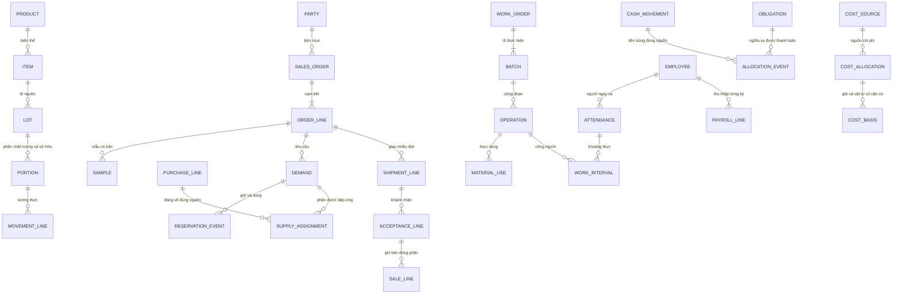

# Thiết kế cơ sở dữ liệu ERP demo Nasaki V1

Theo B27 ngày 08/10/2026: thiết kế dữ liệu đáp ứng yêu cầu và phân nhiệm rõ, **chưa lập trình**. Bản này là thiết kế logic và quy tắc giao dịch, chưa có SQL, migration, máy chủ hoặc dữ liệu vận hành mới. Căn cứ: [33 yêu cầu](functional-requirements.md), [22 màn hình](screen-design.md), [quy tắc](demo-business-rules.md), [nghiệm thu](demo-acceptance.md) và phương án B24. Quy tắc/giá/lịch/QC giả lập vẫn có thể điều chỉnh; không xác nhận quy trình thật Nasaki.

## Giải thích để anh xem thiết kế

Cơ sở dữ liệu giống các sổ nghiệp vụ có liên kết. Một đơn hàng được ghi một lần; kho dùng mã đơn đó để dành và xuất hàng; xưởng dùng để làm phần thiếu; tài chính dùng chứng từ giao và tiền thực nhận để tính nợ. Bộ phận nào tạo thông tin thì chịu trách nhiệm xác nhận thông tin đó. Bộ phận khác đọc phần được phép, không nhập một bản sao riêng.

Ví dụ: khách đặt 10.000 viên không làm kho giảm 10.000. Kho thực xuất 6.000 thì kho giảm đúng 6.000; khách chấp nhận lượng đó rồi kế toán ghi bán thì mới có doanh thu/phải thu của đợt. Tiền cọc 60 triệu nằm trong sổ tiền và nguồn ứng trước, không tự thành doanh thu. Mỗi bước có chứng từ và người xác nhận để biết con số xuất phát từ đâu.

Có ba lớp: **danh mục** (sản phẩm, vật tư, đối tác, người), **hồ sơ công việc** (đơn/lệnh/phiếu có bản và duyệt), **sổ thực tế** (hàng, tiền, công đã xác nhận). Báo cáo đọc từ ba lớp này. Số dư hiện tại là kết quả tính, không phải một con số người dùng sửa trực tiếp.

## Phương án lưu trữ vừa đủ

Đề xuất một cơ sở dữ liệu quan hệ PostgreSQL cho ứng dụng thống nhất có phân hệ. Lý do: quan hệ và ràng buộc rõ, giao dịch nhiều bảng cùng thành công, kiểm soát ghi đồng thời, hỗ trợ báo cáo và sao lưu. Đây là lựa chọn kỹ thuật đề xuất trong thiết kế; chưa cài đặt/chốt phiên bản máy chủ hoặc triển khai.

Chia 11 nhóm tên: `core`, `access`, `catalog`, `sales`, `purchase`, `stock`, `production`, `quality`, `delivery`, `finance`, `hr`. Đây là nhóm quản lý bảng trong cùng DB, không phải 11 máy chủ hoặc thêm 11 bộ phận. Tài chính chứa cả giá thành. Tệp chứng cứ ở kho tệp có quyền; DB lưu chỉ mục/checksum. Git giữ thiết kế và dữ liệu giả lập, không giữ backup hoặc dữ liệu người thật.

[Từ điển dữ liệu](database/data-dictionary.md) có 91 bảng logic, bao gồm dòng chi tiết/lịch sử/quyền dùng chung. Một đơn nhiều mặt hàng cần bảng dòng; một khoản tiền dùng cho nhiều nghĩa vụ cần bảng phân bổ; lịch sử giữ hàng cần sự kiện riêng. Số bảng phục vụ các quan hệ này, không phải 90 tính năng. Có [394 quan hệ FK](database/relationships.csv), kể cả khóa phân vùng bộ demo; [ma trận](database/coverage.csv) nối đủ FR01–FR33/SC01–SC22/A01–A32/X01–X24 tới bảng.

Giữ quy mô 1 công ty/xưởng/kho và 50 người; vị trí kho không thành kho thứ hai, tài khoản không bắt đủ 50. Không tạo kho báo cáo riêng, hệ thống thông điệp, dữ liệu phân tán, bảng cho từng khách/tháng/loại ngói hoặc một DB cho từng bộ phận. Chưa thiết kế kế toán pháp định, thuế/hóa đơn/ngoại tệ, tài sản/khấu hao, HR chuyên sâu hoặc các tích hợp chưa giao.

## Phân nhiệm và nguồn chính

| Nhóm dữ liệu | Người chịu trách nhiệm nghiệp vụ | Nguồn ghi chính | Bộ phận đọc/nhận kết quả |
| --- | --- | --- | --- |
| Danh mục/chứng từ chung | Bộ phận sử dụng lập, giám đốc duyệt phần quan trọng | core, catalog; thông tin nhân sự ở hr | Các phân hệ dùng mã chuẩn/phiên bản được phép. |
| Quyền/phiên/ủy quyền | Quản trị áp dụng quyết định; giám đốc cấp đúng phạm vi | access; quyết định ở core.approval | Hệ thống kiểm mọi đọc/ghi/xuất, không để UI tự quyết. |
| Khách, nhu cầu, giá/đơn/mẫu/đổi hủy | Kinh doanh giữ việc; giám đốc thương mại; khách duyệt phần thuộc khách | sales và đại diện đối tác core.party_authority | Kho/xưởng/giao biết lượng/quy cách/ngày; tài chính biết thỏa thuận tiền. |
| Nguồn cung/đặt mua/đang về | Mua hàng | purchase | Kho nhận từng đợt, QC kiểm, tài chính đối chiếu nghĩa vụ. |
| Lượng hàng/lô/vị trí/giữ/nhập xuất | Kho; sản xuất xác nhận dùng tại xưởng trong phạm vi được giao | stock.movement_line và reservation_event | Kinh doanh/xưởng nhìn được dùng/khả dụng; tài chính đọc lượng để định giá. |
| BOM/lệnh/lô/công đoạn/lịch máy | Quản lý sản xuất; tổ trưởng ghi thực | production | Kho cấp/nhập, HR kiểm người/công, QC kiểm đạt, tài chính tập hợp chi phí. |
| QC, khóa/giải phóng, phương án lỗi | QC kết luận; giám đốc duyệt xử lý; người thực xác nhận | quality; tác động lượng qua stock đúng nguồn | Kho/xưởng/giao ngừng phần bị ngăn; tài chính xử lý giá trị theo phương án. |
| Soạn/giao/khách nhận | Kinh doanh lập yêu cầu; kho xuất; giao hàng ghi nhận | delivery, liên kết phiếu stock | Tài chính chỉ ghi bán phần đủ điều kiện, không xuất lần hai. |
| Tiền/nghĩa vụ/phân bổ/giá trị/giá thành | Kế toán lập/đối chiếu; giám đốc duyệt chi; người thu/chi ghi thực | finance | Giám đốc xem tổng; kinh doanh xem nợ khách phụ trách; xưởng chỉ giá thành tổng hợp được cấp. |
| Hồ sơ/lịch/công/phép/lương | HR giữ hồ sơ/chốt công/lập lương; quản lý xác nhận; tài chính kiểm | hr; thực ứng/trả ở finance | Sản xuất xem kỹ năng/lịch/giờ, không tự mở lương cá nhân. |
| Báo cáo | Đọc đúng quyền, không là nơi nhập số dư | View tổng hợp từ nguồn trên | Có thể mở về chứng từ, mốc và trạng thái nguồn. |

“Phụ trách” là quyền xác nhận và trách nhiệm của phân hệ, không cho nhân viên truy cập DB trực tiếp. Hành động xuyên bộ phận đi qua thao tác nghiệp vụ được giao, ghi các bảng liên quan trong một giao dịch. Ví dụ QC khóa thì hệ thống ghi hold và làm mất hiệu lực giữ; QC không tự sửa cam kết đơn, kho không tự sửa kết luận QC. Giám đốc/CEO vẫn một người, không hai cấp duyệt.

## Quan hệ chủ đạo

Sơ đồ minh họa quan hệ chính, không liệt kê hết 91 bảng; tên viết hoa là nhãn của bảng tương ứng trong từ điển. Các FK đầy đủ và quan hệ tùy chọn nằm trong relationships.csv. Các bảng chứng từ/dòng dùng core.document/core.document_line để phê duyệt, bàn giao và truy nguồn đúng phần, tránh liên kết ID chuỗi không kiểm tồn tại.

## Định danh, phiên bản và thời gian

Dùng UUID làm ID ổn định, mã dễ đọc riêng (SO-N-001, N-04, E023…). Mã duy nhất trong bộ tương ứng; không dùng tên khách hoặc số thứ tự dòng làm khóa liên kết. Mỗi revision có document ID riêng, root ID nối các bản. FK tới bản cụ thể, không tới “đơn hiện tại” có thể đổi. Đổi thương mại tạo bản mới được duyệt/khách xác nhận; phần không ảnh hưởng dùng nguồn hợp lệ đang có. Core chỉ giữ trạng thái phê duyệt, từng phân hệ giữ trạng thái thực hiện riêng.

Bản nháp có thể sửa với row_version và log. Khi đã duyệt/được sử dụng, dữ liệu ảnh hưởng lượng/tiền/quy cách bất biến. Điều chỉnh thêm bản và liên kết nguồn, không xóa dấu vết. Bản thay thế chưa đủ duyệt không tự trở thành nguồn hiện hành; giao dịch thực của bản cũ vẫn giữ và tính vào lũy kế gốc.

Lưu hai mốc: `executed_at/effective_at` (thời điểm nghiệp vụ) và `recorded_at` (lúc hệ thống ghi). Thời điểm có múi giờ, hiển thị Asia/Ho_Chi_Minh; ngày hạn/lịch là ngày địa phương. Sổ có thứ tự posting_sequence để cùng giờ vẫn định giá có thứ tự. Báo cáo chọn mốc nghiệp vụ và, khi cần đối chiếu, mốc thông tin đã biết. Không lấy một trạng thái/giữ hiện tại để xem quá khứ.

Không cho ghi vận động kho mới trước tồn đầu hoặc trước biến động gần nhất có liên quan; điều chỉnh sai cũ được ghi kỳ hiện tại, có ngày sự kiện gốc. Đổi hạn nợ/chốt/mở lại kỳ cần chứng từ điều chỉnh có lịch sử. Khi xem mốc cũ chỉ đọc; trạng thái workflow có thể dựng từ audit hoặc quyết định có thời điểm, sổ lượng/tiền/công dựng từ sự kiện chuyên biệt.

## Quy tắc kho và truy lô

1. `lot` nhận dạng nguồn; `portion` nhận dạng phần cùng chất lượng/quyền sở hữu. Lượng ở từng vị trí được tính từ movement đã posted, phần đến cộng/phần đi trừ. Portion không chứa số tồn có thể sửa tay. Một lô chia đạt/chờ/lỗi hoặc khóa một phần thì chuyển lượng sang portion mới có parent, giữ tổng lượng. Chất lượng không phụ thuộc CC/HL/TP.
2. Phân biệt thuộc doanh nghiệp, bên khác và chưa rõ. Nhận vật lý phải được ghi dù sai nguồn/thừa; phần không đủ căn cứ vào cách ly, không bán/cấp hoặc ghi nghĩa vụ hợp lệ tự động.
3. Tồn kho vật lý chỉ cộng location thuộc KHO-01; lượng xưởng/đang giao/ngoài kho có nơi chịu trách nhiệm riêng. Cấp sang xưởng chưa tự tiêu hao; consume khi thực dùng mới giảm lượng vật tư đang ở xưởng. Nhập thành phẩm không nhân đôi toàn bộ đầu vào vật tư vì khác loại/đơn vị; bảo toàn theo đối chiếu cấp/dùng/hoàn và sản lượng công đoạn/QC.
4. Được dùng = lượng good, company, không hold đang hiệu lực và chưa hết hạn ở mốc. Giữ hợp lệ từ reserve trừ consume/release/invalidate. Khả dụng = được dùng − giữ hợp lệ. Đang về là supply_assignment theo PO, không cộng vào tồn.
5. Khóa phần lô phải cùng lúc invalidate phần giữ bị ảnh hưởng và bàn giao việc thiếu; demand vẫn tồn tại. Multiple hold cùng portion không cộng lượng khóa nhiều lần; chỉ dùng lại khi hết mọi hold và điều kiện QC đủ. Giữ mới/xuất phải kiểm lại ngay lúc ghi.
6. Mỗi dispatch line giảm kho và tăng nơi đang giao. Khi giao hàng xác nhận thực nhận, hành động có thể chuyển trách nhiệm từ transit sang external theo source acceptance qua stock module; không xuất kho lần hai, không ghi giá vốn chỉ từ chuyển trách nhiệm. Hàng bị từ chối vẫn có nơi thực giữ và giá trị chờ/tranh chấp riêng. Thực quay về mới nhận trả vào pending.
7. Nhận trả nguyên liệu/thành phẩm tham chiếu line gốc, trừ các lần trả đã nhận. Phần hoàn vật tư không vượt lượng cấp trừ đã dùng/hao hụt/hoàn. Trả NCC/tiêu hủy chỉ giảm khi thực rời/thực xử lý đúng nơi giữ, đã duyệt chưa giảm.
8. Kiểm kê lưu mốc/sequence và lượng sổ ảnh chụp, đếm thực, lý do; ngừng giao dịch phạm vi đếm hoặc đối chiếu các sự kiện giữa hai mốc. Điều chỉnh có duyệt và đồng thời xử lý giữ thiếu. Đảo một nhập đã được cấp/bán phải xử lý phụ thuộc trước.

## Tiền, nghĩa vụ và chi phí không lẫn nhau

`cash_movement` là tiền thực; `obligation` là khoản phải thu/trả/hoàn; `allocation_event` là việc sử dụng nguồn tiền cho khoản cụ thể. Báo giá, đơn, PO và duyệt lương chưa tự tạo cash. Nhận mua chưa tự có AP: purchase_match đối chiếu phần đạt/chấp nhận và chứng từ rồi mới ghi nghĩa vụ. Dòng lương tính được nhưng chưa đủ duyệt (CEO) vẫn là thu nhập chờ, không coi đã được phép chi.

- Thu cọc tăng cash và tiền chưa dùng đúng chủ/nguồn. Ghi bán phần khách chấp nhận tạo doanh thu và AR. Settle giảm AR, không tăng cash hoặc doanh thu lần nữa. Bên trả khác bên mua cần party_authority đúng đơn; không tự cấn khách khác.
- Ứng nhân viên/NCC là cash out với chủ và mục đích riêng; khi có nghĩa vụ đủ điều kiện mới đối trừ. Lương đã trả theo nghĩa vụ + ứng thực đã áp dụng, không cộng ứng như khoản chi phí lần hai. Tiền chưa rõ không được phân bổ trước đối chiếu.
- Chi cần payment_request được duyệt khác người tự hưởng, không quá phần được trả và số dư. Chuyển quỹ nội bộ ghi hai cash movement cùng transfer_key, cùng transaction; không doanh thu/chi phí. Opening riêng không tạo nghĩa vụ bán/mua giả.
- Giảm bán sau đã thu: điều chỉnh đúng sale_line gốc, reverse phần phân bổ bị ảnh hưởng có căn cứ; nguồn tiền vừa giải phóng phải `reserve_refund` nếu phải hoàn, không đem dùng lần hai. `consume_refund` nối thực chi, giữ phần thu gốc đã sử dụng cho hoàn. Chưa thực hoàn giữ refund payable; nếu khách đồng ý giữ ứng thì phương án đổi rõ và giải phóng hold theo quyết định. Đây là quy tắc đề xuất để bảo toàn nguồn, không mặc định mọi trả hàng đều hoàn.
- Số dư/nghĩa vụ không được sửa tay. Phải thu/phải trả không bù chéo; quá hạn từ ngày sau due_on. Phần đơn chưa ghi bán là cam kết, không là AR. Thuế chưa mô phỏng lưu trạng thái, không thuế suất 0%.

`cost_source` giữ khoản thực dùng/lương/chi phí chung đủ căn cứ. `cost_allocation` và `cost_basis` nối nguồn tới lô hoặc chi phí khác bằng vật tư thực, khoảng công direct hoặc giờ máy actual. Tổng phân bổ không vượt nguồn, giờ không trùng/vượt thực làm. Chờ dưỡng hộ không tự có giờ công. Khi nguồn thay đổi, supersedes nối bản cũ; phân bổ của nguồn cũ phải được chuyển/điều chỉnh cùng nhau, không mở nguồn mới đầy đủ rồi cộng cả hai. Cost_sheet_line cố định các allocations của đúng bản chốt; nguồn chưa đủ thì provisional.

`value_entry` chuyển giá trị giữa source/inventory/WIP/transit/COGS/expense/recovery, tách khỏi lượng. Bình quân sau nhập theo mặt hàng trong bộ, lấy lô vật lý theo điều kiện riêng. Tính giữ độ chính xác, làm tròn HALF_UP ở chứng từ; xuất hết mang giá trị còn. Định giá mua chưa đủ/giá thành chưa chốt không hiện confirmed; chốt bổ sung chỉ ghi chênh giá trị có nguồn, không nhập thêm lượng. Giá trị trả đạt dựa giá vốn gốc và tình trạng, hàng lỗi có phương án giảm riêng. Lãi gộp = bán thuần − COGS, không lãi ròng/tiền ngân hàng; không dựng hệ sổ kế toán pháp định trong vòng này.

## Nhân sự và công/lương tinh gọn

Một employee có identity_key ổn định; nhiều account vẫn cùng người thông qua access.person toàn hệ thống. IAM account/role/permission/session/person nằm ngoài bộ demo; role_assignment xác định quyền vào từng bộ. Hồ sơ employee và chứng từ trong nhánh vẫn trỏ cùng person, nên khôi phục demo không nhân bản người thật hoặc làm mất đăng nhập. Hồ sơ employment có khoảng hiệu lực một bộ phận chính/quản lý/chính sách. Nhận/thử việc/điều chuyển/nghỉ dùng document, employment, qualification và handoff, không mở hệ tuyển dụng/đào tạo chuyên sâu. PPE nối stock movement một lần; sự cố an toàn lưu căn cứ/ảnh hưởng công việc, không tự trừ lương.

Calendar/schedule là dự kiến; attendance/work_interval là công thực đã xác nhận. Khoảng direct bắt buộc lệnh/công đoạn; chờ/hỗ trợ/nghỉ tách. Những khoảng thuộc bản công hiện hành không chồng theo người, không trưa; điều chỉnh giữ bản gốc. Một khoản thiếu giờ giữ pending, không tự đủ ca/không lương. OT cần căn cứ/đồng ý/duyệt và chính sách, chưa đủ thì không tự hệ số.

Sổ leave_event tính entitlement (đầu + phát sinh ± điều chỉnh − dùng), held (giữ − giải phóng − chuyển dùng); khả dụng phép = entitlement − held. Khi nghỉ thực chuyển hold sang use trong một transaction nên không trừ hai lần. Nghỉ không lương không trừ phép năm, ngày nghỉ tuần không thành số phép dùng.

Pay_run cố định kỳ/bản công/chính sách. Pay_line từng người có component và quyết định riêng; không suy bảng approved là mọi dòng đủ quyền. Ứng/thực chi/phân bổ ở finance, không cột paid sửa tay trong payroll. Điều chỉnh công sau chốt tạo bảng/dòng chênh có nguồn, tính lại phần thu nhập và giá thành liên quan; giữ tiền đã chi. Mandatory deduction not_modelled, không gọi thực lĩnh pháp lý hoặc tự phạt do hàng lỗi.

## Giao dịch nguyên tử và ghi đồng thời

| Hành động | Những dữ liệu phải cùng thành công | Khóa/kiểm ngay khi xác nhận |
| --- | --- | --- |
| Giữ hàng | reserve event, dấu vết, bàn giao kết quả, operation receipt | Khóa portion và demand theo ID cố định, tính lại được dùng/giữ; thiếu không nhận đủ. |
| Xuất/cấp/nhập/nhận trả | movement + lines, consume phần giữ, liên kết nguồn, audit, receipt | Portion nguồn/đích, demand, dòng xuất gốc trả; kiểm item/unit/quyền/hold/qty và phần còn. |
| QC/khóa/split | inspection/hold, movement chia phần/chất lượng, invalidate giữ, việc thiếu | Cùng khóa portion, scope và quantity; không để đã khóa nhưng vẫn giữ/xuất hợp lệ. |
| Ghi bán | sale+line, obligation, value_entry chuyển đúng COGS, receipt | Acceptance line, phần đã bán/chưa bán, order version, item valuation; không stock xuất lần hai. |
| Thu/chi/phân bổ/hoàn | cash nếu thực thu/chi, allocation/hold, phần nghĩa vụ, audit/receipt | Cash account, cash source, obligation, request, các allocation gốc; kiểm số dư và người thật. |
| Công/phép/sửa công | Bản công/khoảng, phép giữ/dùng/giải phóng, liên kết điều chỉnh, receipt | Employee/ngày và quỹ phép, các bản/period; loại công/giờ/nghỉ/trùng. |
| Chốt giá thành/điều chỉnh | Source/allocations/sheet/version/value delta, trạng thái nguồn | Nguồn chi phí, batch, item valuation theo thứ tự; bảo toàn nguồn, không ghi lượng mới. |
| Ngừng quyền/nghỉ việc | Quyết định hiệu lực, hồ sơ, thu hồi role/session, bàn giao | Employee và account/phiên liên quan; không xóa lịch sử. |

Dùng ràng buộc FK/UNIQUE/CHECK cho tồn tại, trùng mã/phiên/dòng, lượng dương, độ chính xác, khoảng và kiểu nguồn. Điều kiện tổng nhiều dòng (tồn, tiền chưa dùng, sức chứa, tự hưởng, phụ thuộc, phiên hiện hành) cần transaction, khóa hàng và kiểm nghiệp vụ; một CHECK đơn lẻ không đủ. Với người/nguồn độc quyền có thể dùng exclusion constraint cho khoảng đã xác nhận theo phiên hiện hành; giữ lịch sử bị thay riêng để không bị chặn bởi bản cũ. Chỗ dưỡng hộ có cộng lượng theo thời gian, cần khóa resource và kiểm tổng occupancy, không chỉ kiểm hai khoảng trùng.

Chọn thứ tự khóa cố định theo nhóm/id để tránh vòng chờ; transaction ngắn, không chờ khách hoặc mạng trong transaction. Không khóa mọi DB cho một đơn. Idempotency key cùng action+workspace và request_hash; khóa trùng khác nội dung từ chối. Receipt thành công cùng commit với sổ và source uniqueness bảo vệ ở cấp dòng. Mất phản hồi thì đối chiếu receipt trước thử lại; bản nháp cũ sai row_version phải tải lại. Deadlock/conflict chỉ thử lại với cùng khóa và đọc lại dữ liệu; không nhân đôi phần đã xác nhận.

## Quyền dữ liệu và bảo vệ vận hành

Người dùng chỉ qua ứng dụng. Tài khoản DB runtime khác tài khoản migration/backup/quản trị máy chủ; không dùng superuser làm runtime. Phân hệ được ghi bảng của mình qua hành động được cấp; giao dịch xuyên phân hệ dùng người thực và quyền thao tác tương ứng, không cho client tùy chọn vai trò DB hoặc giả employee_id.

Đề xuất kết hợp quyền theo vai trò/hành động/phạm vi ở backend và Row Level Security theo workspace/chủ việc/bộ phận/người. Context xác thực chỉ backend đặt trong từng transaction, dọn khi trả kết nối; thiếu context từ chối, không xem toàn công ty. HR salary/employment, pay snapshot và cost source cá nhân có quyền riêng; view production chỉ đưa số chi phí tổng được cấp, không hiện payroll_line/rate cá nhân qua liên kết. API, export, attachment và báo cáo đều kiểm quyền; ẩn nút không đủ.

IAM admin E048 chỉ áp dụng cấp quyền có quyết định, không tự mở lương. So identity_key người lập/kiểm/duyệt/người hưởng, không so hai username. Quyền ủy quyền có hạn/nguồn/giới hạn, không nhận ủy quyền tiếp hoặc duyệt tự hưởng. Phiên lưu hash token và expiry/auth_version, ngừng khi account/employee hết hiệu lực. Chứng cứ/lương và credential không vào log chung, URL công khai hoặc Git. Mã hóa đường truyền và nơi lưu/backups, quyền đọc tệp như quyền chứng từ.

Quản trị máy chủ/DB cấp đặc quyền có thể tiếp cận dữ liệu bằng quyền kỹ thuật: phải tách người/credential, giới hạn và ghi giám sát; không hứa RLS ngăn được superuser. Bộ demo chỉ người/chính sách giả lập, quyền thử vai trò có nhãn; không dùng cơ chế giả vai đó cho dữ liệu thật.

## Đọc, ghi và báo cáo hiệu quả

| Đường đọc | Chỉ mục đề xuất | Lưu ý |
| --- | --- | --- |
| Tìm mã/phiên bản | UNIQUE(workspace, code); (workspace,root,revision) | Mã chuẩn hóa/alias có unique riêng; so kiểu nguồn thật. |
| Đơn/việc chờ | (workspace, owner, approval_state, effective_at); handoff(receiver,state,due_at) | Phân trang ổn định theo thời gian+id, không tải tất cả dòng. |
| Kho/lô/theo mốc | lot(item,code); portion(lot); movement(posted,executed_at,sequence); line theo portion/vị trí; reservation theo demand/portion/time | Index riêng hai đầu from/to khi kế hoạch truy vấn cần. Không tạo index mọi cột. |
| Tiền/nghĩa vụ | cash(account,executed_at); obligation(chủ,kind,due_on); allocation(cash,obligation,time) | View số còn theo nguồn, lọc kỳ/đối tượng trước tổng hợp. |
| Công/lịch | attendance(employee,calendar,revision); interval theo attendance/time; booking(resource,time); employment(employee,valid_from) | Xem đúng bản hiện hành hoặc bản tại mốc; index cho FK và kiểm khoảng thực tế. |
| Truy nguồn/giá thành | FK document/source line/lot/batch; cost(source,batch); value(item,bucket,time) | Giữ đường mở về chứng từ và quyền, không đọc lương qua source chung. |

Báo cáo là view/truy vấn có danh sách cột được phép: tồn/giữ/thiếu; lượng lô/đang làm; đơn/giao/tiền; AR/AP/ứng/phải hoàn và tuổi nợ; công/phép/thu nhập/còn trả; chi phí nguồn và lãi gộp. Không có bảng “báo cáo tổng” nhập tay hoặc “lợi nhuận” riêng dễ sai.

Ban đầu đọc sổ theo scope có index đủ cho mô hình nhỏ. Khi có số liệu chứng minh chậm mới thêm snapshot/balance cache, phải tái dựng từ sổ, gắn cutoff+posting sequence và cập nhật cùng transaction; cache không trở thành nguồn nghiệp vụ. Chưa dùng partition, replica hoặc hệ phân tích riêng. Đo truy vấn và số người đồng thời trước đặt mục tiêu tốc độ, không suy 50 nhân sự là 50 truy cập đồng thời.

## Nạp demo, thay đổi cấu trúc và sao lưu

Mỗi dataset workspace chứa cả dữ liệu giao dịch và danh mục tương ứng; FK composite ngăn nhánh dùng lô/tiền/công của cơ sở. Tài khoản người truy cập thật được bảo toàn khi khôi phục demo, quyền vào bộ mới áp dụng có quyết định; account demo theo vai là dữ liệu giả lập của bộ, không credential người vận hành. Parent/anchor của workspace là nguồn mốc, không phép cộng báo cáo cha+con.

Importer tương lai chỉ hai chế độ riêng: mở đầu để thực hiện hoặc snapshot đã hoàn thành để đọc; receipt/checksum bảo vệ chạy lại. Các số expected trong JSON là oracle nghiệm thu ngoài sổ, không nạp làm báo cáo. Các nguồn fixture đã gộp bước nhận/QC/bán phải dựng thành hồ sơ đúng thứ tự, không bỏ bước vì số cuối khớp. X01–X24 là nhánh riêng được tạo từ mốc thích hợp, không cộng 24 nhánh vào cơ sở.

Thay đổi cấu trúc sau này dùng migration có phiên bản trong Git, thử trên bản sao giả lập và đối chiếu trước chuyển. Không tự chạy SQL ngoài lịch sử. Backup DB và kho tệp phải cùng mốc/checksum, lưu cấu hình/quyền/migration version để phục hồi; mã hóa, credential riêng, nơi lưu ngoài máy chủ chính. Đề xuất cho demo phát triển: backup hằng ngày và trước nâng cấp; giữ 7 bản ngày + 4 bản tuần, hạn chế người truy cập. Đây là tham số kỹ thuật đề xuất, chưa tác vụ đã thiết lập.

RPO (mức dữ liệu có thể mất) và RTO (thời gian phục hồi) chưa cam kết: khi chọn hosting sẽ chốt bằng chi phí và thử khôi phục. Nếu chấp nhận mất tối đa 24 giờ với backup ngày thì ghi rõ; cần ít hơn phải thiết kế lưu WAL/khôi phục theo thời điểm. Thử phục hồi DB+tệp/quyền ở môi trường riêng, đối chiếu kho/tiền/công và phiên bản, rồi mới coi backup sử dụng được. Không coi việc sao lưu được một file là đã thử khôi phục.

## Đối chiếu đủ và giữ gọn

| Yêu cầu nghiệp vụ | Nguồn bảng đã có | Phần không tạo thêm |
| --- | --- | --- |
| Danh mục/quyền/bản/duyệt/bàn giao/ghi an toàn | core, catalog, access | Không bảng duyệt riêng cho từng màn hình hoặc hai CEO. |
| Tư vấn/báo giá/đơn/mẫu/đổi hủy | sales và đại diện | Không CRM marketing/tích hợp kênh tự động. |
| Thiếu/mua/nhận/cấp/giữ/QC/lệnh | demand, purchase, stock, production, quality | Không kho thứ hai, không lệnh khách giả cho làm sẵn, không mẫu tính là hàng bán. |
| Giao/bán/cọc/chi/nợ/giá thành/trả | delivery, finance, movement và case | Không phiếu kho lần hai khi bán, không AP từ PO, không trả tiền giả từ duyệt. |
| Nhân sự/công/phép/lương/nguồn công/PPE | hr, finance, qualification và handoff | Không bảng lương người có tài khoản riêng với người không có tài khoản, không HR chuyên sâu. |
| Báo cáo/mốc/nhánh/phục hồi | Views từ sổ, workspace, period, operation_receipt | Không lưu một bản sao số dư cho mỗi bộ phận hoặc hardcode expected. |

Ma trận coverage liệt kê bảng cho từng FR và kế thừa tiêu chí/màn hình đã có. “Đủ” ở đây là bao phủ phạm vi đã đặc tả; không có cơ sở đảm bảo không thiếu với yêu cầu chưa phát sinh hoặc nội bộ Nasaki chưa khảo sát. Mỗi bảng có mục đích/nguồn yêu cầu; khi triển khai có thể điều chỉnh cấu trúc vật lý nếu giữ quan hệ và khả năng kiểm chứng. Không chốt số bảng làm chỉ tiêu phải giữ bằng mọi giá.

## Các lần đối chiếu bắt buộc khi xây sau này

- A07/A18/A19/A20: cọc N60 → AR0; thực xuất6.000 → kho4.840/giá trị29,04 triệu, transit36 triệu, doanh thu0; ghi bán108/phân bổ60 → AR48; thu30 →18; đợt2 ghi72 →90. Kho và doanh thu không đổi từ thao tác phân bổ.
- A08/A09/X11: CEM1.500/giữ300, cần2.400 → thiếu1.200; nhận700 vào pending, QC600 đạt/100 lỗi thì còn thiếu600, không tự AP/cấp toàn700.
- X05/X06: khóa N-04 còn920 → vật lý4.840, được dùng3.920, giữ hợp lệ3.080, khả dụng840, demand thiếu920; truy60 đã giao. Giám đốc duyệt gấp không bỏ hold.
- X07/X08: thực nhận trả500 → vật lý1.340, được dùng vẫn840 trước QC; credit9 triệu/COGS3 triệu có nguồn; khoản phải hoàn mở đến cash out9. Không dùng lại nguồn thu dành hoàn hoặc xuất kho thêm khi credit.
- A24/A25: nguồn T4.354.167 = giá vốn3.591.066 + tồn763.101. Cơ sở hai đơn doanh thu196 triệu, giá vốn63.591.066, tồn6.403.101, ngân hàng686,7 triệu; báo cáo dựng từ sổ, không trường expected.
- A27/A29/A30/X10: phép E023 đầu4.800 → giữ480 → dùng480, còn4.320; thu nhập8 triệu, ứng1 + chi7, còn0 theo mô hình đơn giản. Bảng50 người tính493,36 triệu nhưng CEO chờ; còn thu nhập chưa trả485,36. Sửa chốt tạo chênh300.000 và bản nguồn, không xóa chi cũ.
- X16/X17/X18/X24: hai yêu cầu giữ300 khi khả dụng400 chỉ một thành công; hai phân bổ60 cùng nguồn60 không vượt60. Bấm lại/mất phản hồi không nhân đôi, lỗi giữa các ghi rollback toàn phần.
- X21/X22/X20: kho không mở lương qua cost basis/export; hai tài khoản cùng identity không tự duyệt; đảo nguồn có phụ thuộc bị ngăn; phục hồi chỉ workspace đã cho phép.

Các tình huống này là kế hoạch nghiệm thu DB+ứng dụng sau triển khai. Vòng hiện tại chỉ kiểm cấu trúc tài liệu, quan hệ và độ bao phủ; chưa tạo DB để thử FK/transaction/RLS/đồng thời/backup. Trước lập trình tiếp tục hoàn thiện kiến trúc ứng dụng và kế hoạch triển khai khi anh giao, giữ ràng buộc chưa lập trình của B27.

## Danh sách loại nguồn và sổ được phép

`core.document.type` là danh sách đóng được kiểm với loại dòng, không tên tùy ý do người dùng thêm. Các loại có bảng đầu nghiệp vụ: inquiry, quotation/order, sample, change_case, purchase_order, stock_movement/opening, stock_count, bom, work_order, operation, inspection, disposition, shipment, sale/credit/debit, payment_request, cost_sheet, employment, qualification/incident, equipment_handoff, schedule, attendance, leave_request, payroll_run. Các loại dùng đầu chung và dòng chuyên biệt: delivery_acceptance, purchase_match, cash_record/opening, obligation_adjustment, cost_source, cost_allocation, leave_event, material_need. Các quyết định danh mục/chính sách/cấp quyền/chốt kỳ/đề nghị tuyển đơn giản dùng đầu chung + approval/attachment/handoff; không có dòng lượng/tiền không định kiểu. `document_line.kind` trỏ đúng bảng mở rộng trong từ điển; source/cost/demand có dòng riêng, nguồn gốc nằm ở FK khác nên không hai bảng cùng sở hữu một dòng.

Mọi sổ sự kiện chỉ thêm sau xác nhận và không sửa/xóa. Ngoại lệ có hình thái nháp (`stock.movement`, `finance.sale`, `finance.cash_movement`) phải có posting/execution_state riêng, view chỉ lấy posted. Sự kiện allocation/reservation/hold/leave/value và obligation phát sinh chỉ được tạo trong transaction xác nhận hợp lệ. Giá trị provisional đã thực phát sinh được trình bày tạm tính có nguồn; không trộn với nháp chưa thực hiện. Phiếu nhận kho chưa ghi giá trị đủ vẫn có lượng thực và trạng thái giá trị chờ đối chiếu.
