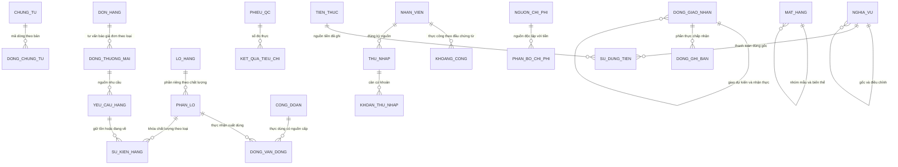

# Thiết kế cơ sở dữ liệu ERP demo Nasaki V1

Theo B29 (thay cấu trúc B27/B28) ngày 08/10/2026: thiết kế phân nhiệm rõ, giữ gọn, tên bảng/trường bằng tiếng Việt và dữ liệu có nguồn. Đây là thiết kế logic; chưa tạo SQL, cơ sở dữ liệu, bộ nạp hoặc lập trình ERP. Căn cứ: [yêu cầu chức năng](functional-requirements.md), [màn hình](screen-design.md), [quy tắc](demo-business-rules.md), [nghiệm thu](demo-acceptance.md) và phương án B24. Các tham số mô phỏng không là quy trình đã xác minh của Nasaki.

## Giải thích để anh đọc

Cơ sở dữ liệu giống các sổ liên kết: kinh doanh ghi đơn, kho ghi thực nhận/xuất, xưởng ghi công đoạn/vật tư thực dùng, QC ghi kiểm tra, nhân sự ghi công, tài chính ghi tiền/nghĩa vụ. Mỗi bộ phận xác nhận phần mình chịu trách nhiệm. Các bộ phận khác đọc qua mã liên kết, không nhập lại một số riêng.

Khách đặt 10.000 viên chưa làm kho giảm. Kho thực xuất 6.000 mới giảm 6.000; khách chấp nhận phần đó rồi có chứng từ ghi bán mới thành doanh thu/phải thu. Tiền cọc 60 triệu là tiền thực và nguồn ứng trước, chưa tự thành doanh thu. Báo cáo tính từ những nguồn đó, không có trường “doanh thu mong muốn” hay “tồn cuối mong muốn”.

Có ba lớp nghiệp vụ: danh mục, hồ sơ công việc có phiên bản/quyết định, sổ sự kiện thực được xác nhận. Thông tin kỹ thuật như mã, thời điểm ghi và phiên đăng nhập bảo vệ ba lớp, không tự tạo kết quả nghiệp vụ. [Rà soát nguồn](database/source-review.md) giải thích chi tiết.

## Cấu trúc và quy mô

Đề xuất một cơ sở dữ liệu quan hệ PostgreSQL cho ứng dụng thống nhất. Quan hệ, giao dịch đồng thời, ràng buộc và sao lưu phù hợp mô hình nhỏ; chưa chốt máy chủ/phiên bản hoặc triển khai. Có 11 nhóm trong cùng cơ sở dữ liệu, không phải 11 máy chủ:

| Nhóm | Phụ trách và nguồn chính | Bộ phận sử dụng |
| --- | --- | --- |
| `dung_chung` | Chứng từ, đối tác, quyết định, bàn giao, căn cứ và lịch sử dùng chung; người lập/xác nhận theo nghiệp vụ | Các phân hệ dùng đúng bản/mã |
| `truy_cap` | Quản trị áp dụng cấp quyền/ủy quyền có quyết định; người thật, tài khoản và phiên | Kiểm mọi đọc/ghi/xuất dữ liệu |
| `danh_muc` | Người phụ trách khai báo sản phẩm, mặt hàng, mã gọi khác, quy đổi | Ngói và Terrazzo dùng đơn vị viên; nguyên liệu có đơn vị tương ứng |
| `kinh_doanh` | Khách/nhu cầu/tư vấn/báo giá/đơn/mẫu/đổi hủy; giám đốc quyết định thương mại, khách xác nhận phần thuộc khách | Kho, sản xuất, giao và tài chính nhận nguồn cần thiết |
| `mua_hang` | Đơn mua và phần hàng đang về có nguồn | Kho nhận từng đợt, QC kiểm, tài chính đối chiếu |
| `kho` | Lô/phần lô, vận động thực, yêu cầu, giữ và kiểm kê; kho xác nhận, xưởng xác nhận thực dùng trong quyền | Kinh doanh/sản xuất đọc lượng được dùng, tài chính đọc lượng định giá |
| `san_xuat` | Định mức theo bản, lệnh/lô/công đoạn, nguồn lực, lịch và vật tư thực dùng | Kho cấp/nhập, QC kiểm, nhân sự đối chiếu công, tài chính tập hợp chi phí |
| `chat_luong` | QC ghi đo/kết luận/khóa/giải phóng, đề nghị xử lý; giám đốc duyệt phần cần duyệt | Kho/xưởng/giao kiểm lại điều kiện dùng hàng |
| `giao_hang` | Đợt/dòng giao và xác nhận khách nhận | Tài chính ghi bán đúng phần đủ điều kiện |
| `tai_chinh` | Tiền thực, nghĩa vụ, sử dụng tiền, ghi bán, đối chiếu, chi phí/phân bổ/giá trị/giá thành | Người được cấp xem kết quả; không lộ lương qua giá thành |
| `nhan_su` | Hồ sơ theo hiệu lực, kỹ năng/an toàn, lịch, công/phép và thu nhập có căn cứ | Sản xuất đọc người/kỹ năng/lịch; tài chính ứng/trả theo nguồn |

[Từ điển](database/data-dictionary.md) có 74 bảng, [trường](database/fields.csv) có 931 trường và [quan hệ](database/relationships.csv) có 402 liên kết trực tiếp. B28 có 91/1.139/487 là lịch sử trước tinh gọn. [Rà soát toàn bộ](database/optimization-review.md) và [ánh xạ](database/name-mapping.csv) giải thích thay đổi. [Ma trận](database/coverage.csv) giữ đủ 33 yêu cầu/22 màn hình/56 tiêu chí. Tên máy tiếng Việt không dấu, nhãn/mô tả có dấu.

Giữ 1 công ty, 1 xưởng, 1 kho và 50 nhân viên. Vị trí trong kho không thành kho thứ hai; không bắt mỗi người có tài khoản. Dòng chi tiết/sự kiện/quan hệ phục vụ nhiều mặt hàng, nhiều đợt và lịch sử, không phải mỗi bảng là một tính năng. Không tạo bảng riêng theo khách/tháng/sản phẩm, máy chủ theo bộ phận hoặc kho báo cáo riêng. Chưa thiết kế kế toán pháp định, thuế/hóa đơn/ngoại tệ, tài sản/khấu hao, nhân sự chuyên sâu hoặc tích hợp chưa giao.

## Quan hệ chủ đạo

Nhãn sơ đồ là tên Việt rút gọn; tên chính xác và toàn bộ quan hệ ở từ điển/CSV. Chứng từ và dòng có mã/bản riêng để phê duyệt, bàn giao và truy nguồn đúng phần. Mã nguồn phải trỏ bản ghi tồn tại, không dùng chuỗi tùy ý thay khóa ngoại.

## Định danh, phiên bản và mốc

Mỗi bản ghi có mã UUID ổn định và mã nghiệp vụ dễ đọc riêng. Mã nghiệp vụ duy nhất trong bộ; không dùng tên người/khách làm khóa. Mỗi bản chứng từ có mã riêng, nối chứng từ gốc và bản bị thay. Mọi liên kết dùng đúng bản, không theo “đơn hiện tại” có thể bị sửa.

Nháp được sửa có kiểm số phiên bản ghi đồng thời và nhật ký. Đã duyệt/được sử dụng thì lượng/tiền/quy cách ảnh hưởng nghiệp vụ bất biến; sửa bằng bản hoặc sự kiện điều chỉnh có nguồn. Bản thay chưa đủ xác nhận không tự hiện hành; giao dịch thực từ bản cũ vẫn tính lũy kế gốc. Trạng thái xử lý của hồ sơ chỉ là dấu vết thao tác có căn cứ; tiến độ tổng hợp tính từ các sự kiện, không là nguồn sửa tay.

Lưu thời điểm thực hiện/hiệu lực và thời điểm hệ thống ghi riêng. Dùng thời điểm có múi giờ, hiển thị Asia/Ho_Chi_Minh; ngày hạn/lịch là ngày địa phương. Sổ vận động có thứ tự ghi để các sự kiện cùng giờ vẫn định giá đúng thứ tự. Báo cáo chọn mốc nghiệp vụ và, khi đối chiếu, mốc thông tin đã biết; không dùng trạng thái hiện tại để dựng quá khứ.

Không ghi vận động mới lùi trước tồn đầu hoặc biến động liên quan gần nhất. Sai cũ điều chỉnh kỳ hiện tại có dẫn ngày sự kiện gốc. Đổi hạn nợ/chốt/mở lại kỳ cần nguồn quyết định và lịch sử. Khi xem mốc cũ chỉ đọc.

## Kho, sản xuất, chất lượng và giao hàng

1. `kho.lo_hang` nhận dạng nguồn, `kho.phan_lo_hang` nhận dạng phần cùng chất lượng/quyền sở hữu. Lượng theo vị trí tính từ dòng vận động đã ghi sổ: đến cộng, đi trừ. Phần lô không chứa cột tồn sửa tay. Chia đạt/chờ/lỗi hoặc khóa một phần bằng chuyển lượng sang phần mới có nguồn cha, giữ tổng lượng; chất lượng riêng với vị trí CC/HL/TP.
2. Nhận vật lý ghi đúng thực tế dù thừa/sai nguồn. Hàng doanh nghiệp/bên khác/chưa rõ phân biệt; thiếu căn cứ giữ cách ly, không tự được bán/cấp hoặc tạo nghĩa vụ mua hợp lệ.
3. Tồn kho vật lý chỉ cộng vị trí thuộc KHO-01. Hàng xưởng/đang giao/ngoài kho có nơi chịu trách nhiệm riêng. Cấp sang xưởng chưa tự tiêu hao; chỉ thực dùng mới giảm vật tư ở xưởng. Đối chiếu cấp = dùng + hao hụt + hoàn + còn, sản lượng từ công đoạn/QC, không nhân đôi đầu vào vì thành phẩm khác loại/đơn vị.
4. Được dùng là lượng đạt, thuộc doanh nghiệp, còn hạn nếu có và hết mọi khóa hiệu lực. Giữ hợp lệ = giữ ban đầu − phần đã dùng/giải phóng/mất hiệu lực. Khả dụng = được dùng − giữ hợp lệ. Hàng đang về theo đơn mua không cộng tồn thực. Nhu cầu tương lai phải có chứng từ/duyệt riêng; OTHER-001 cũ chưa đủ hồ sơ không là nguồn hợp lệ.
5. Khóa phần lô đồng thời làm mất hiệu lực phần giữ bị ảnh hưởng và bàn giao thiếu; yêu cầu hàng vẫn tồn tại. Nhiều khóa trên cùng phần không nhân lượng khóa, chỉ dùng lại khi hết tất cả và đủ QC. Giữ mới/xuất luôn kiểm lại ngay lúc ghi.
6. Lệnh làm sẵn có quyết định riêng, không tạo đơn khách giả. Mẫu/cọc/vật tư và điều kiện cần thiết kiểm trước thực hiện. Ưu tiên cần người quyết định/lý do. Định mức/tỷ lệ đạt dự kiến không sinh lượng thực hoặc QC. Thực bắt đầu/hoàn thành ghi tại công đoạn, đo/kết luận tại QC; thời gian dưỡng hộ không tự thành giờ công.
7. Mỗi dòng xuất giao giảm kho, tăng nơi đang giao. Khách nhận thực có nguồn xác nhận, chuyển trách nhiệm đúng phần; không xuất kho lần hai hoặc ghi giá vốn chỉ từ chuyển trách nhiệm. Khách từ chối giữ nơi thực giữ và hồ sơ tranh chấp. Hàng thực quay về mới nhận trả vào chờ QC.
8. Trả tham chiếu dòng gốc, trừ các lần trả đã nhận. Hoàn vật tư không vượt cấp trừ dùng/hao hụt/đã hoàn. Trả nhà cung cấp/tiêu hủy chỉ giảm khi thực rời/xử lý đúng nơi; duyệt chưa giảm. Xử lý/thu hồi/hạ loại có quy cách và quyết định nguồn, tiến độ từ sự kiện thực.
9. Kiểm kê lưu mốc/thứ tự, ảnh chụp lượng sổ, đếm thực và lý do. Ngừng giao dịch phạm vi đếm hoặc đối chiếu sự kiện giữa hai mốc. Điều chỉnh có duyệt và xử lý giữ thiếu đồng thời. Đảo nguồn đã được cấp/bán phải xử lý phụ thuộc trước.

## Tiền, nghĩa vụ và giá thành

`tai_chinh.bien_dong_tien_thuc` giữ tiền thực, `tai_chinh.nghia_vu_va_dieu_chinh` giữ khoản phải thu/trả/hoàn, `tai_chinh.su_kien_su_dung_nguon_tien` giữ sử dụng nguồn tiền đúng khoản. Đơn/báo giá/đơn mua/duyệt lương chưa tự tạo tiền. Đối chiếu mua chỉ lập nghĩa vụ từ phần nhận đủ điều kiện và chứng từ; không tự phải trả toàn đơn mua.

- Thu cọc tăng tiền thực và nguồn chưa dùng đúng chủ; ghi bán phần khách chấp nhận tạo doanh thu/phải thu. Sử dụng cọc thanh toán giảm nợ, không tăng tiền hoặc doanh thu lần nữa. Bên trả khác bên mua cần căn cứ đại diện đúng đơn/phạm vi; không cấn khách khác.
- Ứng người/nhà cung cấp có chủ/mục đích riêng; chỉ đối trừ khi có nghĩa vụ đủ điều kiện. Ứng đã áp dụng và khoản đã trả đọc từ tiền thực/phân bổ, không tính ứng thành chi phí lần hai. Tiền chưa xác định chủ không phân bổ trước đối chiếu.
- Chi cần đề nghị/duyệt đúng quyền, không tự duyệt tự hưởng, không vượt được phép/số dư. Chuyển quỹ ghi hai biến động tiền cùng khóa chuyển trong một giao dịch; không sinh doanh thu/chi phí hoặc phiếu kho. Số dư đầu cần biên bản, không dựng giao dịch bán/mua giả.
- Giảm bán sau thu điều chỉnh đúng dòng gốc, đảo phần sử dụng tiền bị ảnh hưởng theo nguồn. Nếu phải hoàn, giữ riêng nguồn hoàn; thực chi nối nguồn đó, không mở lại tiền đã dùng cho hoàn để dùng lần hai. Chưa thực hoàn còn nghĩa vụ hoàn. Khách đồng ý giữ ứng cần phương án và xác nhận riêng, không mặc định mất cọc/hoàn mọi trả hàng.
- Còn nợ và số dư tính từ sổ, không sửa tay hoặc bù chéo phải thu/phải trả. Quá hạn từ ngày sau hạn hiệu lực; phần đơn chưa bán là cam kết. Thuế chưa mô phỏng không tự đặt 0% để coi đã tính đủ.

`tai_chinh.nguon_chi_phi`, `tai_chinh.phan_bo_chi_phi` và `tai_chinh.can_cu_phan_bo_chi_phi` nối thực dùng, công đã xác nhận và chi phí chung tới lô/việc khác bằng vật tư, phút công trực tiếp hoặc phút máy thực. Tổng phân bổ không vượt nguồn, giờ không chồng/vượt thực làm. Nguồn sửa có bản thay, phân bổ nguồn cũ phải điều chỉnh cùng, không mở hai nguồn đầy đủ rồi cộng đôi.

Bản chốt nối đúng phiên bản nguồn/phân bổ; tổng giá thành/đạt/thiếu tính từ đó. Chưa đủ thì tạm tính. `tai_chinh.bien_dong_gia_tri` tách lượng và chuyển giá trị giữa nguồn, tồn hàng, dở dang, đang giao, giá vốn, chi phí kỳ, thu hồi. Bình quân sau nhập theo mặt hàng trong bộ, lô vật lý theo điều kiện riêng. Tính chính xác rồi làm tròn nửa lên tại chứng từ; xuất hết mang giá trị còn. Chốt/sửa định giá ghi chênh giá trị có nguồn, không thêm lượng. Trả đạt căn cứ giá vốn gốc/tình trạng; lỗi theo phương án riêng. Lãi gộp = bán thuần − giá vốn, không đồng nghĩa lãi ròng hoặc tiền ngân hàng.

## Nhân sự tinh gọn

Nhân viên trỏ định danh người ổn định toàn hệ thống; nhiều tài khoản vẫn cùng người. Năm bảng người/tài khoản/vai trò/quyền/phiên tách bộ demo, cấp vai trò có phạm vi từng bộ. Khôi phục/nhánh thử không nhân bản người vận hành hoặc mất đăng nhập. Hồ sơ việc làm theo hiệu lực có một bộ phận chính/quản lý/chính sách. Nhận/thử việc/điều chuyển/nghỉ dùng hồ sơ/chứng từ/bàn giao, không thêm hệ tuyển dụng/đào tạo chuyên sâu. Bảo hộ nối phiếu kho thực một lần; sự cố không tự trừ lương.

Lịch/phân công là dự kiến; bản công/khoảng công là thực có xác nhận. Công trực tiếp cần lệnh/công đoạn, chờ/hỗ trợ/nghỉ tách. Khoảng hiện hành không chồng theo người hoặc chứa trưa; sửa giữ bản gốc. Thiếu nguồn giữ chờ, không tự đủ ca hoặc không lương. Làm thêm cần căn cứ/đồng ý/duyệt/chính sách, không tự hệ số.

Sổ phép = đầu + phát sinh ± điều chỉnh − dùng; giữ = giữ − giải phóng − chuyển dùng; khả dụng = phép còn − đang giữ. Nghỉ thực chuyển giữ sang dùng cùng giao dịch, không trừ đôi. Nghỉ không lương/ngày nghỉ tuần không tự trừ phép năm.

Kỳ thu nhập cố định kỳ/bản công/chính sách. Mỗi dòng có khoản và quyết định riêng, không lấy một trạng thái toàn kỳ để duyệt mọi dòng. Dòng giám đốc chờ kiểm độc lập theo quyền. Tổng thu nhập tính từ khoản; ứng/trả/còn từ tiền và phân bổ. Sửa công sau chốt có bản chênh và tính lại chi phí liên quan, giữ tiền đã chi. Chưa mô phỏng khoản bắt buộc, không gọi thực lĩnh pháp lý.

## Giao dịch và ghi đồng thời

| Hành động | Phần phải cùng thành công | Kiểm/khóa tại xác nhận |
| --- | --- | --- |
| Giữ | Sự kiện giữ, nhật ký, bàn giao, biên nhận chống lặp | Phần lô/yêu cầu; tính lại được dùng/giữ, không nhận đủ nếu thiếu |
| Nhập/xuất/cấp/trả | Phiếu/dòng vận động, dùng phần giữ, nguồn, nhật ký/biên nhận | Phần nguồn/đích, dòng gốc, mặt hàng/đơn vị/quyền/khóa/lượng còn |
| QC/chia/khóa | Kết luận/khóa, vận động chia phần, mất hiệu lực giữ, việc thiếu | Cùng phần lô/phạm vi/lượng; không để khóa nhưng vẫn xuất hợp lệ |
| Ghi bán | Chứng từ/dòng bán, nghĩa vụ, giá trị, biên nhận | Phần khách nhận chưa bán, đơn/bản, nguồn giá vốn; không xuất lần hai |
| Thu/chi/dùng tiền/hoàn | Tiền thực nếu có, sử dụng/giữ nguồn, nghĩa vụ, nhật ký/biên nhận | Quỹ/nguồn/nghĩa vụ/đề nghị/phân bổ gốc; số dư và người thật |
| Công/phép/điều chỉnh | Công/khoảng, phép giữ/dùng/giải phóng, nguồn sửa, biên nhận | Người/ngày/quỹ phép/bản/kỳ, giờ/nghỉ/trùng |
| Chốt/sửa giá thành | Nguồn/phân bổ/bản chốt/chênh giá trị | Nguồn/lô/mặt hàng theo thứ tự; bảo toàn giá trị, không sinh lượng |
| Ngừng quyền/nghỉ việc | Quyết định/hồ sơ/thu hồi quyền và phiên/bàn giao | Người và tài khoản/phiên liên quan; giữ lịch sử |

Khóa ngoại/duy nhất/kiểm tra bảo vệ tồn tại, trùng mã/bản/dòng, lượng dương, đơn vị/khoảng/kiểu nguồn. Điều kiện tổng nhiều dòng cần giao dịch và khóa hàng: tồn, tiền chưa dùng, sức chứa, tự hưởng, phụ thuộc, bản hiện hành. Nguồn độc quyền có thể dùng ràng buộc khoảng không chồng; bản lịch sử đã thay tách khỏi kiểm hiện hành. Chỗ dưỡng hộ cộng lượng theo thời gian, khóa nguồn lực và kiểm tổng, không chỉ kiểm hai khoảng trùng.

Thứ tự khóa cố định theo nhóm/mã, giao dịch ngắn và không chờ khách/mạng khi đang khóa. Khóa chống ghi lặp gắn hành động/bộ/bản băm yêu cầu; trùng khóa khác nội dung từ chối. Biên nhận cùng lần ghi với sổ, nguồn duy nhất kiểm ở dòng. Mất phản hồi đối chiếu biên nhận trước thử lại. Xung đột bản nháp tải lại; thử lại giao dịch dùng cùng khóa và đọc lại nguồn, không nhân phần đã xác nhận.

## Quyền, đọc/ghi và lưu trữ hiệu quả

Người dùng chỉ qua ứng dụng. Tài khoản ứng dụng tách quyền chuyển cấu trúc/sao lưu/quản trị, không dùng tài khoản toàn quyền để chạy thường. Kết hợp vai trò/hành động/phạm vi và đề xuất Row Level Security theo bộ/chủ việc/bộ phận/người. Ngữ cảnh xác thực chỉ máy chủ đặt trong giao dịch và dọn khi trả kết nối; thiếu ngữ cảnh từ chối.

Lương/hồ sơ cá nhân/nguồn công và chi phí cá nhân có quyền riêng; xưởng chỉ đọc chi phí tổng được cấp. API, xuất tệp, chứng cứ và báo cáo đều kiểm quyền, không chỉ ẩn nút. Quản trị E048 áp dụng cấp quyền có quyết định, không tự mở lương. Kiểm cùng định danh người ở lập/kiểm/duyệt/người hưởng, không chỉ so tên tài khoản. Ủy quyền có phạm vi/hạn/giới hạn và không tiếp quyền/tự hưởng. Ngừng tài khoản/người thu hồi phiên; mật khẩu/bản băm/lương/chứng cứ không vào nhật ký công khai/Git.

Khởi tạo định danh/quyền nền có nhật ký kỹ thuật và có thể chưa có tài khoản thực hiện; không tạo người duyệt nghiệp vụ giả để giải vòng phụ thuộc. Sau khởi tạo tài khoản người thực lấy từ phiên tin cậy, không cho client chọn. Tài khoản quản trị máy chủ vẫn có thể tiếp cận dữ liệu: cần tách người/quyền và giám sát, không hứa ràng buộc cấp dòng chặn quản trị toàn quyền.

Chỉ mục đề xuất cho mã/bản trong bộ, khóa ngoại, chủ việc/ngày hạn, lô/vị trí/mốc vận động, quỹ/nguồn/mốc tiền, người/ngày/ca và khoảng nguồn lực, nguồn chi phí/lô. Tên cột chính xác theo từ điển, chỉ mục vật lý chốt khi thiết kế truy vấn. Phân trang ổn định, lọc phạm vi/kỳ trước tổng hợp; không tải mọi dòng hoặc tạo chỉ mục mọi cột.

Báo cáo tồn/giữ/thiếu, tiến độ, giao/tiền, nợ/ứng/hoàn, công/phép/thu nhập, chi phí/lãi gộp là truy vấn từ nguồn đúng quyền/mốc. Không có bảng nhập báo cáo tổng hoặc số lợi nhuận riêng. Khi đo được chậm mới thêm bộ nhớ đệm/ảnh chụp có thể dựng lại từ nguồn và cập nhật đồng bộ; chúng không thành nguồn. Chưa dùng phân tán/phân vùng/hệ phân tích riêng; 50 nhân sự không đồng nghĩa 50 truy cập đồng thời.

## Nạp, thay đổi và sao lưu

Bộ cơ sở/nhánh có danh mục và giao dịch riêng; khóa cùng bộ ngăn dùng lô/tiền/công của nhánh khác. Người/tài khoản truy cập thật được bảo toàn; quyền vào bộ mới có quyết định. Mốc cha không là phép cộng báo cáo cha và con.

Bộ kiểm V1 trộn giả lập/kết quả tính/kết luận giả định, **không nạp nguyên tệp thành nguồn**. [Kiểm kê](database/source-review.csv) rà từng trường; [chính sách nạp](demo-data/source-policy.json) chặn năm tệp trực tiếp, có mã kiểm toàn vẹn. Đây là thiết kế, chưa có bộ nạp để cưỡng chế. Bộ khởi tạo nguồn mới chưa tạo; khi chuẩn bị phải có chứng từ/chủ thể/đơn vị/mốc/bản/người ghi và xác nhận. Thiếu giữ chờ, không dựng chứng cứ/nhu cầu/công/tiền để khớp số cuối. Các nhánh ngoại lệ là thử độc lập, số mong đợi chỉ nằm trong bộ kiểm.

Thay đổi cấu trúc tương lai có phiên bản trong Git, thử trên dữ liệu giả lập trước chuyển. Sao lưu cơ sở dữ liệu và kho tệp cùng mốc/mã kiểm, gồm cấu hình/quyền/phiên bản cấu trúc, mã hóa và quyền riêng, lưu ngoài máy chủ chính. Đề xuất sao lưu ngày và trước nâng cấp, giữ 7 bản ngày + 4 tuần; chưa thiết lập tác vụ. Mức mất dữ liệu/thời gian phục hồi chốt khi chọn môi trường và thử phục hồi. Sao lưu ngày chỉ đáp ứng mức mất tối đa 24 giờ nếu được chấp nhận; cần ít hơn phải thiết kế khôi phục theo thời điểm. Thử phục hồi dữ liệu/tệp/quyền riêng và đối chiếu nguồn, không coi có tệp sao lưu là đã phục hồi thành công.

## Bao phủ và kiểm chứng

Mỗi bảng nối yêu cầu trong ma trận; không chốt số bảng làm chỉ tiêu bất biến. “Đủ” là phủ phạm vi đã đặc tả, không đảm bảo nội bộ Nasaki chưa khảo sát sẽ không phát sinh yêu cầu mới. Loại chứng từ/dòng/giá trị phân loại dùng danh sách Việt đóng ở từ điển; [thuộc tính JSON](database/structured-fields.md) cũng đóng. Một dòng có đúng một bảng sở hữu và nguồn gốc bằng liên kết; không chứa lượng/tiền không định kiểu.

Sổ sự kiện chỉ thêm sau xác nhận. Hồ sơ tiền/phiếu kho/ghi bán có nháp riêng, nháp không vào sổ. Nghĩa vụ/sử dụng tiền/giữ/khóa/phép/giá trị phát sinh trong giao dịch xác nhận đủ điều kiện. Giá trị tạm tính đã thực phát sinh có nguồn được trình bày riêng; nhận vật lý chưa định giá vẫn có lượng thực, không nhập lại khi bổ sung giá trị.

Kiểm khi xây sau này: cọc không doanh thu; xuất/khách nhận/ghi bán tách; giữ/khóa/đếm thiếu đúng phần; trả/hoàn không dùng lại nguồn; định giá bảo toàn; công/phép không trừ đôi; lương giám đốc chờ độc lập; hai người giữ/dùng tiền không vượt cùng nguồn; bấm lại hoặc lỗi giữa các ghi không nhân đôi; quyền kho không mở lương; phục hồi không trộn nhánh. Số minh họa A/X cũ chỉ áp dụng nếu có đủ nguồn giả lập đúng tình huống; bổ sung hoặc loại OTHER-001 sẽ cần tính lại phần thiếu, không bắt kết quả cũ quyết định nguồn mới.

Vòng hiện tại chỉ kiểm tài liệu/tên/quan hệ/bao phủ/kiểm kê mẫu; chưa kiểm SQL/khóa ngoại trên DB, giao dịch, quyền, đồng thời, hiệu năng hoặc phục hồi. [Lịch sử](build-history.md) ghi đúng phạm vi. Ràng buộc chưa lập trình B27 tiếp tục có hiệu lực.

## B28 — tên tiếng Việt và dữ liệu gốc

Toàn bộ tên nhóm/bảng/trường hiện hành là tiếng Việt không dấu, có nhãn và mô tả có dấu. [Danh sách trường](database/fields.csv) liệt kê cả trường chung: ý nghĩa, kiểu, giá trị phân loại cho phép, nguồn, người phụ trách, điều kiện ghi, quan hệ và ràng buộc. [Ánh xạ trường trước/sau B29](database/name-mapping.csv) đối chiếu tên tiếng Việt của B28 với cấu trúc tinh gọn; tên tiếng Anh trước B28 nằm trong lịch sử Git. Các khóa/phiên/mốc ghi/bản băm là dữ liệu kỹ thuật cần thiết để bảo toàn nguồn, không tạo kết quả nghiệp vụ.

Đã bỏ 21 trường trùng kết quả hoặc trạng thái tổng hợp khỏi nguồn hiện hành; [danh sách](database/derived-fields.csv) giải thích nguồn thay thế. Tổng giá thành, tổng thu nhập, còn trả, tồn khả dụng, phần thiếu, tiến độ lô/giao/xử lý và tình trạng chi/thu tính từ dòng hoặc sự kiện có căn cứ. Các bản chính thức như đơn giá đã thỏa thuận, phân bổ chi phí, công thức tính đã chốt và giá trị ghi nhận vẫn lưu khi cần đối chiếu, nhưng phải khóa đúng nguồn/phiên bản, không được coi là đầu vào độc lập. Căn cứ quyết định chốt lệnh và khai báo chính sách được bổ sung bằng liên kết chứng từ/người khai báo; không mất thông tin do loại cột tổng.

Nguồn nghiệp vụ là quan sát/thỏa thuận/quyết định thực được ghi nhận, không bắt buộc tất cả là số đo vật lý. Bảng danh mục và tham số vẫn cần thiết, nhưng ngưỡng tồn, năng lực máy, tỷ lệ dự kiến, chính sách giá/lương/QC chỉ có hiệu lực theo bản được khai báo và duyệt. Thuật toán được tính/đề xuất để người có quyền xem; không tự ghi quyết định ưu tiên, mua, sản xuất, đạt QC hoặc trả tiền.

Chưa có dữ liệu nội bộ Nasaki đủ chứng từ để xác nhận là nguồn thật. Dữ liệu trên website là công bố doanh nghiệp; các mẫu nhân viên/giao dịch/công/lương hiện có đều giả lập. Rà soát này làm rõ đường truy nguồn và cô lập dữ liệu kiểm tra, không biến dữ liệu giả lập thành dữ liệu thật.

## B29 — giảm cấu trúc và thao tác cho ít người vận hành

[Rà soát](database/optimization-review.md) là quyết định kỹ thuật hiện hành: 74 bảng/931 trường/402 quan hệ trực tiếp, thay 91 bảng của B28. Đầu kho/kiểm kê/bán/công/chốt giá thành dùng Chứng từ chung; các đầu chuyên biệt còn lại dùng khóa chung, không nhập hoặc lưu lại người lập/bản ở đầu thứ hai. Thực dùng vật tư là dòng kho có công đoạn và cấp gốc; không sao lượng vào bảng khác. Quyền, QC và khoản thu nhập vẫn là bảng con có khóa ngoại, không thêm JSON để che số lượng.

Mọi phân loại và tham chiếu sau gộp kiểm [loại nguồn](database/source-contracts.csv), các trường không áp dụng trống, phiên bản/phạm vi/đồng thời giữ nguyên. Phân quyền phải theo loại và cột qua view/API cho phép, không cấp cả bảng chung cho một vai bộ phận. Chứng từ chung có cả dữ kiện riêng từng loại nên không còn hoàn toàn tự ghi; người nhập tại biểu mẫu nghiệp vụ, thông tin kỹ thuật tự ghi.

[Trách nhiệm nhập](database/input-responsibility.md) thay danh sách B28; [đối chiếu luồng](database/workflow-coverage.md) rà nguồn và hành vi từng phân hệ. Một dữ kiện nhập một lần, phiếu kế tiếp lấy nguồn và chỉ thêm dữ kiện mới. Không đổi xác nhận thực thành tự động, không thêm duyệt mỗi bước thông thường. Số đầu mối vận hành và tham số còn là đề xuất demo. Chưa thử SQL, đo hiệu năng, hành vi biểu mẫu hoặc chạy ERP.

Chứng từ thông thường không cần phê duyệt theo B24 dùng trạng thái `khong_yeu_cau`; đây không là “đã duyệt”. Kho/xưởng/người thu tiền vẫn xác nhận thực đúng quyền trước ghi sổ, không phát sinh yêu cầu duyệt giám đốc hoặc quyết định giả.
