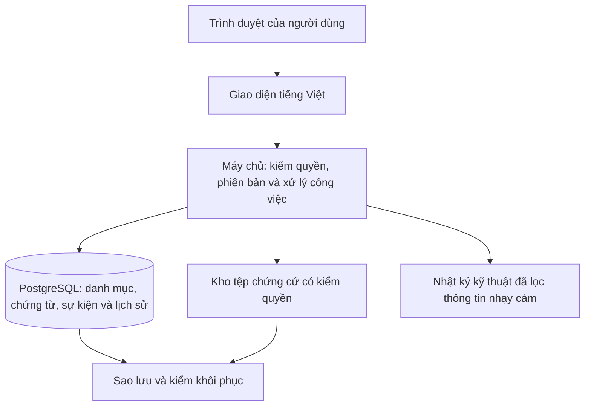

# Đợt 1 — Phân tích và kế hoạch xây nền Mini-ERP

Ngày 09/10/2026, Asia/Bangkok. **Hồ sơ đề xuất gốc B32; đã được anh chốt triển khai tại B38.** Cụ thể hóa D01 của [kế hoạch tổng thể](development-plan.md), theo thiết kế B29 và trách nhiệm B24. Các mục dưới đây là công việc/đầu ra cần xây và kiểm trong tương lai, không thay bằng chứng triển khai. Bản chạy, kiểm đạt và giới hạn hiện tại xem [báo cáo D01](implementation/foundation.md).

[B34/B35 — sử dụng website](website-use-proposal.md): anh đã chốt mở bằng trình duyệt, không cài ứng dụng máy tính. Anh đã đồng ý phương án thiết bị/truy cập/nháp/nhiều tab/đăng nhập chi tiết tại B36; kết quả triển khai/đo tại B38 được ghi riêng trong báo cáo D01.

## 1. Mục tiêu bàn giao

Một ứng dụng trình duyệt đăng nhập được, khai báo và đọc lại dữ liệu thật trong PostgreSQL, kiểm đúng quyền và có lịch sử. Nền này nhận các phân hệ sau mà không phải dựng lại tài khoản, danh mục, chứng từ hoặc cách lưu dữ liệu. Anh mở ứng dụng và đánh giá nghiệp vụ; Codex thực hiện cài đặt, chạy, kiểm tra và xử lý lỗi.

Đợt 1 có danh mục, hồ sơ/lịch nền, cơ chế chứng từ và dữ liệu mở đầu có nguồn. Vòng đặt hàng–giao–thu hoàn chỉnh thuộc D02; đơn mua, lệnh sản xuất, chấm công/lương đầy đủ và giá thành thuộc các đợt tương ứng. Không gọi màn hình tổng quan nền là báo cáo doanh thu/lợi nhuận khi chưa có giao dịch.

## 2. Cấu trúc hệ thống

Một ứng dụng thống nhất; các khối nghiệp vụ dùng chung nền, không tách máy chủ theo bộ phận. Trình duyệt gửi yêu cầu, máy chủ xác minh và ghi dữ liệu; người dùng không truy cập DB trực tiếp. Sheets giữ vai trò mẫu cấu trúc/tham chiếu, không ghi song song thành sổ giao dịch.

| Khối nền | Việc cần xây trong D01 | Người dùng nhìn thấy |
| --- | --- | --- |
| Truy cập và quyền | Định danh người, tài khoản/phiên, vai trò/hành động/phạm vi; cấp/thu hồi có căn cứ, lịch sử; quyền quản trị kỹ thuật tách quyền nghiệp vụ | Đăng nhập/đăng xuất, đổi mật khẩu, danh sách việc được phép; bị chặn khi thiếu quyền |
| Danh mục chung | Một công ty/xưởng/kho; bộ phận/vị trí/đơn vị, ngói/Terrazzo/vật tư, nhóm/biến thể/mã gọi khác/quy đổi; đối tác/liên hệ | Tìm/lọc/phân trang, thêm/sửa danh mục; ngừng sử dụng mục cũ khi cần, không xóa mất lịch sử |
| Người và lịch nền | Hồ sơ hiệu lực của 50 người, bộ phận/quản lý; kỹ năng/an toàn nếu có nguồn; ngày/ca, nguồn lực và lịch dự kiến | Hồ sơ cơ bản và lịch; không mặc định mỗi người phải có tài khoản hoặc đủ công |
| Chứng từ và nguồn | Mã/bản/loại, dòng và liên kết; nháp/xác nhận theo loại; đề nghị/quyết định, bàn giao, chứng cứ và nhật ký | Xem nguồn, người lập/xác nhận, bản và lịch sử; biết thiếu gì để được xác nhận |
| Ghi dữ liệu an toàn | Kiểm loại nguồn, bộ dữ liệu, quyền/phiên bản tại lúc ghi; nguyên tử/chống lặp; dữ liệu đã dùng không sửa đè | Bấm lại không tạo hai bản; sửa bản cũ nhận thông báo xung đột; lỗi không lưu nửa chừng |
| Mở đầu và vận hành demo | Bộ demo mới có nguồn, tồn/giá trị/tiền đầu theo hồ sơ; phần QC mở đầu tối thiểu; sao lưu/khôi phục có kiểm | Xem số mở đầu và mở xuống căn cứ; trạng thái chờ/đạt/lỗi riêng; bản thử không trộn dữ liệu |

Khung phê duyệt dùng lại cho các đợt sau, nhưng chưa xây một công cụ tự thiết kế quy trình tổng quát. Chỉ áp dụng thẩm quyền B24 cho loại nguồn đang xây; không thêm bước giám đốc vào mọi lần sửa danh mục. CEO và “giám đốc” là cùng người. Kiêm nhiệm hoặc hai tài khoản không được vượt quy tắc tự duyệt cùng định danh.

## 3. Phạm vi dữ liệu và màn hình

### Dữ liệu

| Nhóm của B29 | Bảng liên quan D01 | Mức sử dụng |
| --- | --- | --- |
| Dùng chung | T001–T014, T024–T026 | Danh mục, bộ demo, chứng từ/nguồn/nhật ký và cấu hình theo loại hiện có; kỳ/chính sách có căn cứ, chưa tự chốt kỳ toàn ERP |
| Truy cập | T015–T020, T072, T074 | Định danh/phiên/quyền và biên nhận; khởi tạo nền có nhật ký kỹ thuật; ủy quyền chỉ trong phạm vi loại thao tác đã xây |
| Mặt hàng | T021–T023 | Nhóm mẫu, biến thể, mã gọi khác và đơn vị/quy đổi; nhóm mẫu không được ghi vào dòng hàng thực |
| Người và lịch | T063–T066, T042, T046 | Hồ sơ hiệu lực, căn cứ kỹ năng/an toàn, ca/nguồn lực/lịch dự kiến; chưa tạo công thực hoặc khoản lương |
| Nguồn mở đầu hàng/QC | T034–T036, T038, T047–T048 | Lô/phần lô, lượng đầu có biên bản; kiểm/kết luận/khóa mở đầu có căn cứ, tối thiểu đủ xác định phần dùng được; chưa là toàn bộ QC/xử lý lỗi |
| Nguồn mở đầu tiền/giá trị | T051, T053, T062 | Quỹ, biến động tiền/giá trị loại mở đầu đúng hồ sơ; chưa thu/chi/giao/bán hoặc chốt giá thành |

Mã bảng trỏ [từ điển hiện hành](database/data-dictionary.md). Đây là phạm vi sử dụng, không bắt mọi bảng trên có dòng dữ liệu hoặc có màn hình riêng. Lập danh sách phụ thuộc FK từ [relationships.csv](database/relationships.csv) trước migration: nếu bảng nền cần đích ở đợt sau, tạo cấu trúc đích đúng B29 và để trống hoặc sắp xếp migration theo phụ thuộc. Không bỏ FK, tạo bản ghi giả hoặc thêm bảng thay thế để giải vòng liên kết. Cấu trúc được tạo sớm không có nghĩa nghiệp vụ đã triển khai. Danh sách bảng/trường/constraint vật lý và các bảng kỹ thuật framework phải được ghi/đối chiếu trong D01.

Nhân sự được giả lập theo mô hình đã đề xuất, giữ nhãn nguồn. Danh mục nguồn lực không tự lấy công suất website để suy ra năng lực ca. Thiếu kỹ năng/chính sách/chứng cứ thì lưu thiếu và chặn thao tác cần chúng, không tự xác nhận đủ điều kiện.

### Màn hình

Tái sử dụng các loại màn hình hiện có: SC01 tổng quan nền (không số bán/lãi giả); SC02 việc thiếu nguồn/chờ xử lý; SC03 mặt hàng/vật tư; SC04 phần đối tác/liên hệ; SC17 hồ sơ cơ bản; SC18 phần lịch dự kiến; SC22 cấu hình/quyền/bộ demo. Nguồn mở đầu dùng phần tương ứng của SC08/SC09 (hàng), SC12 (QC), SC14 (quỹ/tiền), có biểu mẫu nguồn dùng chung. Đây là phạm vi từng phần của màn hình, không tuyên bố đã hoàn thiện toàn SC hoặc thêm các loại màn hình mới.

Mỗi biểu mẫu có trường cần nhập, nguồn lấy lại, điều kiện thiếu, lưu nháp/xác nhận nếu phù hợp và thông báo lỗi bằng tiếng Việt. Lọc/phân trang phía máy chủ, không tải mọi hồ sơ xuống trình duyệt. Không dùng quản trị Django làm giao diện vận hành chính; quyền trong công cụ quản trị kỹ thuật cũng không mặc định là quyền đọc lương.

## 4. Thứ tự và phương pháp triển khai

| Bước | Phương pháp | Đầu ra và điểm kiểm |
| --- | --- | --- |
| 1 — Chốt thiết kế vật lý nền | Đọc nguồn B29, lập danh sách trường/FK/loại nguồn phụ thuộc và bản đồ quyền; xác định khởi tạo người/quyền không cần người duyệt giả | Đặc tả vật lý, quyền, thay đổi nếu có và các ca kiểm; mọi khác biệt với B29 giải thích được |
| 2 — Dựng môi trường | Django/PostgreSQL, phiên bản tương thích còn hỗ trợ và khóa dependencies; cấu hình dev/test tách biệt; tạo migration | Khởi tạo từ DB trống được, kết nối được, có đường mở bản phát triển cho anh |
| 3 — Làm một lát cắt nhỏ | Đăng nhập đúng quyền → thêm sản phẩm/đối tác → DB → mở lại → lịch sử | Chứng minh lưu thật, quyền đúng, xung đột và bấm lặp trước khi nhân rộng biểu mẫu |
| 4 — Hoàn thiện nền dùng chung | Danh mục/người/lịch, chứng từ/phiên bản/căn cứ, tệp và bàn giao theo loại D01 | Các biểu mẫu dùng chung, dữ liệu đúng nguồn/bộ, phân quyền và lịch sử; thiếu nguồn giữ chờ |
| 5 — Lập nguồn demo mới | Tách danh mục/tham số, hồ sơ mở đầu và hành động xác nhận; chạy theo người có quyền trong bộ riêng | Tồn đạt/chờ/lỗi và tiền/giá trị đầu mở xuống hồ sơ; nạp lặp không ghi đôi, nguồn chưa đủ không dùng |
| 6 — Kiểm DB và trình duyệt | Kiểm ràng buộc/transaction trên PostgreSQL; thử vai trò, xung đột, lỗi giữa bước, mất phản hồi và tệp; thử khởi động lại/khôi phục | Báo cáo từng ca đạt/chưa đạt, nhật ký build và bản có thể tái tạo; lỗi chặn được sửa trước bàn giao |
| 7 — Bàn giao D01 | Trình diễn kịch bản nền, hướng dẫn ngắn, lưu commit/migration và kết quả; ghi phần chưa xây | Anh khai báo/lưu/xem lại được; danh sách hạn chế rõ; đủ cơ sở dự báo D02–D08 và bắt đầu luồng bán |

Làm từng lát cắt dữ liệu–xử lý–màn hình–kiểm, không làm hết DB rồi hết giao diện mới kiểm. Thử các thao tác có rủi ro ngay lúc xây. Codex chịu trách nhiệm kỹ thuật; anh đánh giá đúng công việc, dễ hiểu/dễ dùng và sửa giả định nghiệp vụ khi cần. Thời lượng chưa cam kết; sau bước 3 dùng kết quả thực để cập nhật dự báo còn lại. Thay đổi nghiệp vụ hoặc phát sinh chi phí được ghi thành đề xuất cụ thể, không đẩy câu hỏi thư viện cho anh.

## 5. Yêu cầu kỹ thuật và cách chứng minh

| Yêu cầu | Cách thực hiện đề xuất | Cách kiểm trong D01 |
| --- | --- | --- |
| Kiến trúc gọn | Một Django app theo module, một PostgreSQL; giao diện máy chủ và JS cần thiết; cấu trúc theo framework | Khởi tạo/chạy từ cấu hình mẫu; chỉ tạo module/thư mục khi có mã thực |
| Tên và cấu trúc | Tên bảng/trường lưu trữ tiếng Việt không dấu, nhãn/mô tả có dấu; giữ ý nghĩa B29; bảng kỹ thuật có danh sách/ánh xạ riêng, tuân thủ yêu cầu đặt tên | So cấu trúc DB với fields/relationships/source-contracts; không có bảng nghiệp vụ ngoài thiết kế chưa giải thích |
| Dữ liệu chính xác | UUID/mã nghiệp vụ đúng phạm vi; Decimal/NUMERIC theo từ điển, không số thực nhị phân cho tiền; UTC có múi giờ khi lưu, hiển thị Asia/Ho_Chi_Minh; ngày lịch riêng | Ca đơn vị viên và vật tư, số lẻ/tiền/ngày/mốc; ràng buộc tại DB, không chỉ JS |
| Toàn vẹn nguồn | FK cùng bộ/đúng bản/đúng loại; loại nguồn/JSON đóng có kiểm; giá trị bắt buộc theo loại; khóa bất biến nguồn đã dùng | Cố gửi ID bộ khác, loại nguồn sai, bản cũ, thiếu chứng cứ và sửa nguồn đã xác nhận phải bị chặn |
| Xác thực | Mật khẩu băm bằng cơ chế framework; phiên hữu hạn/thu hồi được; CSRF, cookie phù hợp; giới hạn thử đăng nhập và thông báo không lộ tài khoản | Sai mật khẩu, hết/thu hồi phiên; đăng xuất rồi gửi lại yêu cầu ghi bị từ chối. HTTPS bắt buộc khi truy cập qua mạng; dev nội bộ cấu hình riêng |
| Quyền | Mặc định từ chối; kiểm vai trò+hành động+bộ+loại+dữ liệu tại máy chủ; quyền được dùng phải còn hiệu lực ngay lúc ghi | Thử URL/POST trực tiếp, tìm kiếm/xuất/tệp; người kiêm nhiệm, hai tài khoản cùng người; thu hồi không chỉ ẩn menu |
| Quyền DB | Tài khoản ứng dụng không toàn quyền, tách migration/backup; chính sách cấp dòng cho bảng nền theo bộ với ngữ cảnh máy chủ tin cậy; IAM toàn hệ thống bảo vệ riêng | Đổi/kế thừa kết nối không lộ bộ; không ngữ cảnh thì từ chối; vai trò chạy thường không bỏ qua bảo vệ. Các bảng tương lai được kiểm khi triển khai |
| Lưu nguyên tử/chống lặp | Dữ liệu nguồn, liên kết, lịch sử và biên nhận cùng transaction; khóa yêu cầu gắn bộ/hành động/bản băm; xung đột phiên bản được báo | Lỗi giữa lần ghi không để bản lẻ; cùng khóa/cùng dữ kiện trả kết quả cũ, khác dữ kiện từ chối; hai người sửa không ghi đè im lặng |
| Tệp và lịch sử | Tệp riêng ngoài Git, giới hạn loại/kích thước có cấu hình, tên lưu an toàn, tải qua kiểm quyền; lịch sử nghiệp vụ không cho người dùng sửa/xóa | Tệp không quyền không tải được; kiểm đầu vào nguy hiểm, thiếu tệp giữa bước không coi đủ nguồn; log không chứa mật khẩu/token/toàn bộ hồ sơ nhạy cảm |
| Nguồn mở đầu | Biên bản lượng/giá trị/quỹ cùng mốc, đơn vị/chủ/người ghi/xác nhận đúng quyền; QC kết luận theo dữ kiện có căn cứ | Số dư dựng lại từ nguồn, không đơn bán/PO/chi phí giả; thiếu quyền/nguồn giữ chờ; mở đầu không tạo doanh thu |
| Cô lập demo | Người/tài khoản/quyền ổn định; bộ dữ liệu và nguồn thuộc bộ; công cụ khởi tạo chỉ cho môi trường/bộ được phép | Nạp lại không thêm trùng; không dùng nguồn nhánh khác; khôi phục bộ không phục hồi quyền đã thu hồi |
| Khôi phục | Sao lưu DB và tệp có mốc/phiên bản; phục hồi vào môi trường riêng rồi đối chiếu; quyền hiện hành phải được áp dụng lại, không mở đăng nhập từ snapshot cũ | Khởi động lại còn dữ liệu; phục hồi cả tệp/nguồn, đối chiếu số và kiểm quyền sau phục hồi. D01 thử nền, D08 thử cả ERP |
| Bảo trì | Dependencies khóa phiên bản, cấu hình mẫu không bí mật, migration có lịch sử, kiểm tự động theo thay đổi; log/health check cho app và DB | Chạy lại từ hướng dẫn trên DB trống; cập nhật cấu trúc không mất nguồn; ghi commit/lệnh/kết quả trong build-history |
| Hiệu năng vừa đủ | Chỉ mục theo mã/FK/phạm vi/lọc, phân trang; đo thay vì tạo cache hoặc hệ phân tích sớm | Đề xuất mục tiêu trang danh mục thường dưới 2 giây ở 5 phiên đồng thời; bộ tải giả lập riêng. Ghi máy/dữ liệu/phân vị p95, chưa là cam kết đã đạt |

Mục tiêu tải trên là **đề xuất kiểm nền**, không suy từ 50 nhân sự ra 50 người truy cập. Khi triển khai phải công bố bộ đo (ví dụ 50 hồ sơ, 100 mặt hàng, 1.000 đối tác thử, trang 50 dòng), đo cả truy vấn/máy chủ/trình duyệt và ghi phạm vi mục tiêu 2 giây; dữ liệu tải không là nguồn demo Nasaki. Máy 2 CPU/4 GB RAM có thể là cấu hình thử ban đầu, cần đo rồi điều chỉnh, chưa là cấu hình tối thiểu bảo đảm hoặc chi phí đã duyệt. Hạn phiên, kích thước tệp và lưu backup là tham số kỹ thuật phải ghi rõ giá trị thực khi xây.

Không tự triển khai reset toàn hệ thống, công khai dữ liệu hoặc mua hosting. Trong D01, thử khôi phục bộ nền vào môi trường riêng; cơ chế khôi phục không mở lại IAM/quyền đã thu hồi. Tác vụ sao lưu tự động, mức mất dữ liệu/thời gian phục hồi và môi trường demo từ xa cần chốt và thử theo kế hoạch vận hành; chưa có bằng chứng để hứa các mức đó. Quản trị máy chủ vẫn có quyền đặc biệt, không hứa RLS ngăn quản trị toàn quyền.

## 6. Sản phẩm cuối đợt 1 và nghiệm thu

**Anh nhận được:** bản nền có cách mở rõ ràng, biểu mẫu/danh sách tiếng Việt, bộ nguồn demo mới tách biệt, quyền làm việc theo vai trò, nguồn mở đầu có căn cứ và hướng dẫn trình diễn ngắn. Tất cả còn sau mở lại/khởi động lại.

**Hồ sơ kỹ thuật bàn giao:** mã nguồn trong Git, cấu hình mẫu/hướng dẫn khởi chạy cho Codex, dependencies khóa phiên bản, migration/đối chiếu cấu trúc, bản đồ quyền, bộ khởi tạo nguồn, kiểm thử tự động/kết quả DB và trình duyệt, thao tác sao lưu/khôi phục đã thử cho nền, nhật ký build và danh sách giới hạn. Tệp backup/bí mật không đưa lên Git. Chưa bàn giao đơn hàng/sản xuất/lương hoàn chỉnh ở đợt này.

| Mã kiểm D01 | Điều kiện đạt tối thiểu |
| --- | --- |
| N01 | Khởi tạo DB trống và chạy lại được từ mã/cấu hình; tên/trường/FK/loại nguồn khớp phạm vi vật lý đã công bố |
| N02 | Đăng nhập/đăng xuất/hết phiên/thu hồi hoạt động; không chỉ đổi góc nhìn của prototype |
| N03 | Người đúng quyền khai báo sản phẩm/đối tác; người sai quyền bị chặn cả yêu cầu trực tiếp và đọc/tải tệp |
| N04 | Lưu, mở lại, khởi động lại app/DB không mất dữ liệu; lịch sử gắn người thật từ phiên, client không tự chọn người xác nhận |
| N05 | Bấm/gửi lặp không ghi đôi; cùng khóa khác nội dung bị từ chối; lỗi giữa lần ghi hoàn tác dữ liệu/nhật ký/biên nhận liên quan |
| N06 | Hai người sửa cùng bản nhận xung đột; nguồn đã dùng không sửa/xóa đè; ngừng danh mục vẫn truy lịch sử được |
| N07 | Giữ một công ty/xưởng/kho, đủ hồ sơ giả lập 50 người; lịch không thành công thực; tài khoản chỉ cấp người cần dùng |
| N08 | Nhóm/biến thể ngói/Terrazzo và đơn vị vật tư phân biệt; mã gọi khác không sinh hàng trùng hoặc tự coi các màu thay nhau |
| N09 | Tồn/giá trị/tiền mở đầu mở xuống biên bản và xác nhận; phần chờ/lỗi không dùng; thiếu QC/nguồn không tự đạt; không tạo doanh thu |
| N10 | Cả năm tệp mẫu cũ vẫn bị chặn nạp trực tiếp theo chính sách; OTHER-001 thiếu hồ sơ không được đưa vào nguồn |
| N11 | Nhánh/bộ riêng không trộn nguồn; khởi tạo lại không trùng; quyền toàn hệ thống còn hiện hành sau thử khôi phục bộ |
| N12 | Chứng cứ đọc đúng quyền, lịch sử/nhật ký không lộ mật khẩu/token; lỗi/mất phản hồi có cách đối chiếu trạng thái trước gửi lại |
| N13 | Khôi phục bản nền gồm DB/tệp vào môi trường kiểm riêng thành công; kiểm lại nguồn/quyền, không chỉ có tệp backup |
| N14 | Ghi kết quả kiểm tự động và trình duyệt, môi trường đo tải/mục tiêu đạt hoặc chưa đạt; không còn lỗi chặn lưu/quyền/toàn vẹn D01 |

N01–N14 là checklist nghiệm thu đợt nền, không thay 56 tiêu chí V1 hoặc tự đánh dấu toàn FR đã xong. D01 đóng góp vào FR01–FR06, FR12, FR28–FR29 và FR33; nguồn mở đầu thuộc FR01 chuẩn bị dữ kiện cho FR17/FR20/FR25 theo [ma trận V1](design/traceability.csv). Các điều kiện giao dịch của từng nghiệp vụ được kiểm tiếp khi xây D02–D08. Chỉ kết luận hoàn thành D01 khi có bản chạy và bằng chứng trên DB/trình duyệt, không từ kiểm tài liệu lần này.
