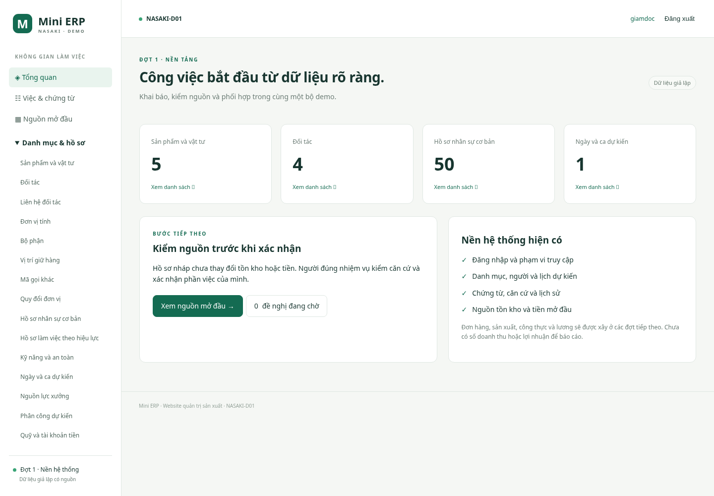

# B38 — Bản nền Mini ERP chạy thật

Ngày 09/10/2026 (Asia/Bangkok). Anh đã chốt phương án website/Django/PostgreSQL và giao lập trình D01. Báo cáo này ghi phiên bản mã trong commit chứa tài liệu, trên nền `0ef1a10`; thay thế trạng thái “chưa lập trình” của kế hoạch cũ. Không đánh dấu toàn bộ 33 FR hoặc bảy phân hệ hoàn thành.

## Kết quả có thể sử dụng

Ứng dụng web lưu vào PostgreSQL: đăng nhập/đăng xuất/đổi mật khẩu; vai trò và quyền theo bộ; tạo tài khoản từ định danh đã khai báo; đề nghị cấp/thu hồi để giám đốc duyệt rồi áp dụng; ủy quyền xem/khai báo/sửa danh mục có hạn. Không tự duyệt quyền của mình, kể cả hai tài khoản cùng người. Quyền/phiên hiện hành được kiểm lại tại lúc ghi.

Có 17 biểu mẫu danh mục/hồ sơ dùng chung: sản phẩm/vật tư, đối tác/liên hệ/đại diện, đơn vị/quy đổi/mã gọi khác, bộ phận/vị trí, nhân sự/hồ sơ hiệu lực/kỹ năng, ca/nguồn lực/phân công dự kiến, quỹ và chính sách có căn cứ. Có tìm kiếm, trang 50 dòng, xuất Excel theo quyền và xem trước/xác nhận nhập Excel cho sản phẩm/đối tác. Nhập danh mục không xác nhận chất lượng, công hoặc nghiệp vụ tiền. Ca và tham số được khai báo bằng ô/giờ/lựa chọn; người dùng không nhập JSON.

Có hồ sơ nguồn, trình/duyệt đúng bản, chứng cứ riêng, bàn giao giữa người giao và người nhận, lịch sử đã lược dữ liệu nhạy cảm; nguồn nhân sự/tệp đi theo quyền hồ sơ. Hàng mở đầu có lô/phần lô và lượng, chưa đủ QC vẫn chờ; kiểm được trước hoặc sau xác nhận lượng. QC khai báo quan sát/kết quả riêng cho từng tiêu chí đã duyệt. Giá trị hàng và tiền mở đầu do tài chính ghi/xác nhận có nguồn, không tạo doanh thu. Biến thể cần quyết định đúng mặt hàng trước dùng; đã dùng/duyệt thì không sửa đè quy cách.

Nháp danh mục lưu trên máy chủ khi có mạng, mở lại trong bảy ngày; báo chưa lưu khi mất mạng. Kiểm phiên bản nháp/hồ sơ, chống gửi lặp và hoàn tác toàn lần ghi khi lỗi. Đổi bộ ở tab khác thì biểu mẫu cũ bị chặn. Trạng thái chờ được đọc lại mỗi 20 giây khi trang đang hiển thị, không đổi dữ liệu đang nhập. Điện thoại có menu danh mục riêng và bảng cuộn trong khung.



## Phạm vi dữ liệu và khác biệt đã giải thích

- 74 bảng/931 trường/402 FK B29 được tạo để giữ đầy đủ phụ thuộc; bảng thuộc đợt sau để trống. Không phải 74 màn hình hay 74 việc nhập hằng ngày. Tạo 43 trigger kiểm loại nguồn theo hợp đồng, thêm kiểm loại phần kế thừa D01. FK cùng bộ, NUMERIC/Decimal cho lượng/tiền, UUID, UTC và hiển thị giờ Việt Nam.
- Một thiếu sót phát hiện khi chạy DB: T053 tiền thực và T062 giá trị kế thừa T006 nhưng danh sách loại dòng của T006 thiếu hai loại tương ứng. Migration `006` bổ sung `dong_tien_thuc`, `dong_gia_tri`; từ điển/fields.csv đã cập nhật. Không thêm bảng/trường nghiệp vụ hoặc nới FK để vượt lỗi. File Sheets B30 là ảnh chụp B29 cũ và **chưa cập nhật hai lựa chọn này**; không dùng nó làm sổ giao dịch hay nạp toàn bộ 74 trang. Khi cập nhật mẫu Sheets phải đồng bộ đúng hai lựa chọn/mô tả, không tự sửa hàng nghiệp vụ.
- Thêm đúng ba bảng kỹ thuật tiếng Việt trong `nen_tang`, có mô tả từng trường tại migration `012`: `phien_ban_cau_truc` (tên migration, SHA-256, mốc áp dụng), `ban_nhap_bieu_mau` (ID, bộ, chủ, biểu mẫu, nội dung chưa xác nhận, phiên bản, mốc lưu), `gioi_han_dang_nhap` (tên đã băm, lần sai, cửa sổ). Không là nguồn lượng/tiền/duyệt; nháp không tham gia số dư. Không tạo bảng auth/admin/session ORM riêng ngoài B29.
- Khởi tạo kỹ thuật mới: một công ty/xưởng/kho, bốn vị trí thuộc cùng kho/xưởng, năm bộ phận đề xuất, 50 định danh/hồ sơ **giả lập**, sáu tài khoản vai trò. Không tự có tồn/tiền/QC/công/lương/doanh thu. Vai trò là cấu hình demo do Codex khai báo, không quyết định của Nasaki thật. Chạy lại giữ dữ liệu, mật khẩu và thu hồi, không tái cấp quyền. Không gọi bootstrap với tên khác để nhân bản tài khoản toàn hệ thống.
- Bộ trình diễn `mini_erp` và kiểm `mini_erp_test` tách nhau. Các nguồn đã xác nhận ở kiểm thử có biên bản giả lập và được ghi qua đúng dịch vụ/actor; không nạp năm tệp mẫu cũ. Bộ tải 100 mặt hàng/1.000 đối tác chỉ nằm DB kiểm. Người quản trị máy chủ vẫn có quyền đặc biệt; RLS bảo vệ vai trò ứng dụng, không hứa chống chủ DB.

## Cách mở và vận hành cho Codex

Anh không cần cài PostgreSQL hoặc dùng SQL. Tài khoản/mật khẩu/secret/backup nằm ngoài Git trong `.runtime` và không được đưa vào chat/log công khai. Website hiện chạy tại `http://127.0.0.1:8000` **trong máy phát triển của Codex**. Đây chưa là đường dẫn Internet mở được từ máy của anh. Có ảnh giao diện kèm báo cáo để xem ngay; chưa mua hosting/tên miền hoặc triển khai công khai.

Công cụ kỹ thuật dành cho Codex (không yêu cầu chủ dự án chạy):

```bash
python -m venv .venv
.venv/bin/pip install -r requirements-dev.txt
.venv/bin/python scripts/local_setup.py
.venv/bin/python scripts/run_local.py runserver 127.0.0.1:8000 --noreload
```

`local_setup.py` dùng PostgreSQL thật qua pgserver để chạy trong môi trường không có Docker/root, tạo DB dev/test/restore riêng và vai trò `mini_erp_app` không superuser/không bypass RLS. DB đã có thì không xóa/đổi mật khẩu hay khôi phục quyền cũ. `run_local.py` loại credential migration/backup khỏi môi trường tiến trình web. `scripts/install_db.py` dùng chủ migration riêng, khóa phiên bản bằng checksum; không sửa tệp SQL đã chạy. `scripts/generate_schema.py` chỉ sinh bản xem trước trong `.runtime`, không ghi đè migration `001` đã áp dụng.

Phiên tám giờ; chặn từ năm mật khẩu sai trong 15 phút; tệp tối đa 5 MB, PDF/PNG/JPEG/TXT có kiểm nội dung/hash, tải qua quyền; Excel .xlsx tối đa 500 dòng/lần, 20 MB giải nén, không công thức, xem trước riêng chủ/bộ hết hạn sau 30 phút; danh sách xuất tối đa 10.000 dòng/lần. Không có luồng nhập mọi bảng, lưu token/mật khẩu rõ hoặc đưa dữ liệu nguồn vào localStorage. Không có API xóa nguồn đã xác nhận.

Sao lưu/khôi phục: `scripts/backup_restore.py` lưu DB custom dump + tệp + manifest SHA-256/migration. Khôi phục chỉ vào DB riêng `mini_erp_restore`, chặn đích live; đối chiếu quyền/định danh/vai trò/ủy quyền hiện hành, thu hồi toàn bộ phiên trong snapshot, không tự cấp quyền mới nếu hồ sơ duyệt chưa nằm trong bản phục hồi. Bộ kiểm chạy trường hợp thu hồi quyền **sau** backup rồi restore: quyền không mở lại. Thao tác này là bài kiểm khôi phục nền ở môi trường riêng; chưa là reset online/bấm nút xóa dữ liệu hoặc backup định kỳ có SLA.

## Bằng chứng kiểm

Các lệnh và thời điểm được ghi tại [build-history](../build-history.md). Bộ kiểm PostgreSQL có **17 nhóm tình huống**; trình duyệt là Chromium thật, không thay bằng kiểm HTML tĩnh.

| Tiêu chí D01 | Bằng chứng và phạm vi đạt |
| --- | --- |
| N01 | DB kiểm trống → 13 migration, chạy lại giữ checksum; đối chiếu từng bảng/trường đúng 74/931; FK/loại nguồn đúng phạm vi công bố |
| N02 | Đăng nhập/đăng xuất/hết phiên/CSRF; thu hồi phiên/quyền và nguồn cấp quyền đã hết hạn bị chặn |
| N03 | Thêm danh mục đúng quyền, POST tài chính trái quyền bị chặn; hồ sơ/tệp nhân sự không đọc được bằng vai trò kho; quản trị không có mặc định HR |
| N04 | Lưu rồi tìm/mở lại bằng Chromium; khởi động lại ứng dụng và PostgreSQL giữ các đối tác đã lưu; actor lấy từ phiên |
| N05 | Cùng khóa trả kết quả cũ, khác nội dung bị chặn; hai giao dịch đồng thời cùng khóa chỉ một nguồn; gây lỗi giữa ghi hoàn tác nguồn/audit/biên nhận |
| N06 | Hai tab cùng bản: tab hai 409; dòng tồn đã ghi không sửa; DB chặn đổi mặt hàng đã dùng kể cả người không đọc kho |
| N07 | Một công ty/xưởng/kho, 50 hồ sơ, sáu tài khoản; lịch chồng bị chặn, không sinh công thực/lương |
| N08 | Ngói/Terrazzo có nhóm/biến thể, phải theo viên; vật tư KG có số lẻ đúng độ chính xác; mã gọi khác là tham chiếu mặt hàng |
| N09 | Nguồn ngói đạt/Terrazzo lỗi/vật tư chờ, lượng/giá trị/quỹ có biên bản; QC sau xác nhận lượng; chưa duyệt mặt hàng vẫn không dùng; không ghi bán/doanh thu |
| N10 | Cả năm tệp mẫu cũ chặn theo tên/hash; OTHER-001 chặn vì thiếu hồ sơ; hash mẫu không đổi |
| N11 | RLS không ngữ cảnh không đọc được; nguồn bộ khác không đọc/FK không nhận; bootstrap lặp không thêm; khôi phục không phục hồi quyền cũ |
| N12 | Sai định dạng tệp bị chặn, tải kiểm quyền/hash; nháp mở lại, mất mạng báo chưa lưu; gửi lại/biên nhận đối chiếu không ghi đôi |
| N13 | Restore thật PostgreSQL và tệp, đối chiếu tiền đầu/quyền/phiên; không chỉ tạo tệp backup |
| N14 | 17 nhóm kiểm đạt, 17 danh mục/biểu mẫu mở qua browser, tạo/tìm/nháp/mất mạng/nhiều tab/điện thoại 390 px đạt; đo 5/10 phiên ghi tại performance.json |

[Đo hiệu năng](performance.json): Linux, Python 3.12.14, môi trường báo năm CPU logic. Máy chủ đo 50/100 yêu cầu, trình duyệt 15/30 lượt; mỗi trang 50 dòng. Đây là tải giả lập cùng máy, không chứng minh máy 2 CPU/4 GB, truy cập Internet, mức sẵn sàng hoặc mọi thao tác ERP. Kết quả CI GitHub là riêng; cấu hình đã thêm nhưng chỉ báo đạt CI khi đọc trạng thái thực.

## Giới hạn và bước sau

D01 có mã/lưu/nguồn/quyền và kiểm nền. Chưa có vòng bán–giao–thu D02, mua/sản xuất/công/lương/giá thành hoàn chỉnh, báo cáo lợi nhuận hoặc kế toán thuế. Chưa có đồng bộ Sheets API hai chiều, cổng khách tự đăng ký, offline, email/SMS khôi phục, reset online hoặc sao lưu tự động. Các khả năng này không được suy ra từ số bảng đã tạo.

PostgreSQL dev do pgserver đóng gói là **16.2**, chỉ dùng kiểm nội bộ; bản Internet phải dùng bản vá PostgreSQL 16 còn hỗ trợ mới nhất được kiểm, tách môi trường/bí mật, HTTPS/reverse proxy, DEBUG=0, giới hạn body và phục vụ static riêng trước mở. Chưa triển khai Gunicorn/HTTPS/hosting, chưa kiểm điều kiện vận hành từ xa; không gọi bản dev là production-ready. Bước tiếp theo hợp lý là cho anh xem/duyệt luồng nền và chuẩn bị phương án URL demo có HTTPS trong phạm vi chi phí/môi trường đã chốt, rồi xây D02 dựa trên nguồn nền.
