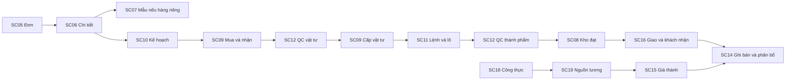

# Thiết kế màn hình ERP demo Nasaki

Thiết kế ngày 08/10/2026 phục vụ B26, dựa trên [33 yêu cầu chức năng](functional-requirements.md) và [bộ nghiệp vụ V1](demo-business-rules.md). Có 22 loại màn hình, dùng danh sách/chi tiết/tab/biểu mẫu thống nhất để giữ thao tác gọn. [Prototype có thể bấm chuyển trang](design/prototype.html) giúp xem bố cục và biểu mẫu; chỉ là mẫu thiết kế, không xác nhận nghiệp vụ, không lưu hoặc xử lý tồn/tiền/lương. Không phải bản ERP chạy thực tế. Tham số nghiệp vụ V1 tiếp tục là giả lập có thể chỉnh, chưa chọn công nghệ ứng dụng.

## Cấu trúc điều hướng và trình bày

Thanh bên gồm Tổng quan, Việc cần xử lý, Kinh doanh, Mua và kho, Sản xuất, Chất lượng, Tài chính, Nhân sự, Báo cáo, Cấu hình. Chỉ hiện phần theo nhiệm vụ; một người kiêm nhiệm có thể thấy nhiều phần, không tạo người/cấp duyệt mới. Tìm mã nguồn/đối tác/biến thể trong danh sách, giữ bộ lọc khi mở chi tiết và quay lại. Các báo cáo có mốc rõ, lịch thao tác dùng ngày/giờ địa phương; dữ liệu xem lại mốc cũ chỉ đọc, không xác nhận giao dịch trên số quá khứ.

Trên máy tính: thanh bên 224 px; vùng chính tiêu đề/mốc/người, thông tin trạng thái, bộ lọc, bảng hoặc tab chi tiết; vùng bên phải là điều kiện còn thiếu và công việc kế tiếp. Trang chi tiết ưu tiên 2 cột; không nhồi toàn bộ dữ liệu vào một form. Điện thoại dùng menu mở/đóng, một cột, bảng có cuộn ngang riêng; các nút chính chạm được, không cuộn ngang toàn trang.

Màu xanh cho đủ điều kiện/đã thực hiện, vàng cho chờ/tạm tính, đỏ cho bị ngăn/lỗi, xám cho nháp; luôn kèm chữ, không chỉ dựa màu. Bảng căn phải lượng/tiền, ghi đơn vị, không hiển thị phần không biết là 0. Nút có nhãn động từ cụ thể: “Gửi duyệt”, “Xác nhận thực xuất”, “Ghi khách chấp nhận”, “Ghi nhận bán”, “Xác nhận thực thu”. Không có một nút “Hoàn tất” thay toàn bộ các sự kiện.

## Thành phần dùng chung

| Thành phần | Bố cục và trường | Hành vi bắt buộc khi xây ứng dụng |
| --- | --- | --- |
| Danh sách | Tìm kiếm, loại/trạng thái/mốc/chủ việc, mã nguồn, các cột chính, phân trang/tổng đúng phạm vi | Tìm không có kết quả hiển thị cách bỏ lọc; tổng theo cùng bộ lọc, không lấy tổng toàn doanh nghiệp nếu không có quyền. |
| Chi tiết nguồn | Mã/bản/trạng thái/đầu mối; tab nội dung, liên kết, điều kiện, lịch sử; các hành động đúng nhiệm vụ | Hết hiệu lực/bản đã thay chỉ xem; giữ nơi xuất phát khi mở chứng từ liên quan. |
| Form nháp | Nhóm thông tin bắt buộc, trường nguồn chọn từ danh mục, dòng lượng/đơn vị, ghi chú | Nhãn rõ, kiểm theo dòng; giữ nội dung khi lỗi; nháp chưa ghi sổ. Rời trang có nội dung chưa lưu thì nhắc lưu hoặc bỏ rõ ràng. |
| Duyệt và xác nhận | Bản/phạm vi, người lập/kiểm, căn cứ, quyết định/lý do; số trước/sau và người thực khi xác nhận | Xem tác động trước xác nhận, kiểm lại quyền/phần còn ngay lúc gửi; không duyệt khoản tự hưởng. |
| Tiếp nhận bàn giao | Nguồn/bản, phần gửi/đủ/thiếu, bên giao/nhận/ngày cần | “Tiếp nhận” hoặc “Yêu cầu bổ sung” có lý do; thiếu còn người giữ việc. |
| Nhật ký và điều chỉnh | Người thật, ngày thực/ghi, hành động, bản cũ/mới, nguồn phụ thuộc, lý do | Không xóa giao dịch đã ghi; log chung không chứa số lương nhạy cảm. |
| Trống/tải/lỗi/không quyền | Câu giải thích cụ thể, nút thích hợp; vùng đang tải không thay bằng số 0 | Lỗi dữ liệu giữ form, lỗi mạng có đối chiếu trước thử lại, không gửi lặp mù quáng. Không quyền không hiển thị nội dung nhạy cảm dưới lớp che. |
| Đã có người thay đổi | Số/bản mới, phần thiếu và nút tải lại | Không tự ghi đè; kiểm lại tổng trước xác nhận khi mở lại, không dùng dữ liệu cũ. |

Prototype hiện hỗ trợ điều hướng, tìm/lọc dòng, mở bảng mẫu, chọn góc nhìn vai trò và biểu mẫu bố cục. Form không xác nhận lưu; vai trò là minh họa bố cục, không là xác thực/phân quyền thật. Các trạng thái tải/lỗi/đồng thời và tất cả nghiệp vụ thật được đặc tả ở đây, phải thực hiện/kiểm trên ứng dụng khi xây.

## Danh mục 22 màn hình

### SC01 Tổng quan

- **Người sử dụng:** Giám đốc hoặc bộ phận đúng quyền.
- **Thông tin và bố cục:** Mốc báo cáo; doanh thu đã ghi, lãi gộp có căn cứ, số dư; công việc/cảnh báo liên quan.
- **Thao tác:** Chọn mốc, mở nguồn, đi đến việc.
- **Trạng thái và giới hạn:** Không mở lương/giá vốn cho vai trò không được phép.
- **Lối vào mẫu:** `prototype.html#home`; chi tiết/tab nằm trong cùng loại màn hình. Nguồn yêu cầu xem [ma trận truy vết](design/traceability.csv).

### SC02 Việc cần xử lý

- **Người sử dụng:** Người giữ việc/người duyệt.
- **Thông tin và bố cục:** Loại việc, nguồn/bản, người giao/nhận, thời hạn, phần thiếu, quyết định/lý do.
- **Thao tác:** Tiếp nhận, yêu cầu bổ sung, gửi duyệt, duyệt/từ chối/đề nghị sửa.
- **Trạng thái và giới hạn:** Không duyệt toàn danh sách không xem căn cứ; ngăn tự duyệt và bản đã đổi.
- **Lối vào mẫu:** `prototype.html#tasks`; chi tiết/tab nằm trong cùng loại màn hình. Nguồn yêu cầu xem [ma trận truy vết](design/traceability.csv).

### SC03 Sản phẩm và vật tư

- **Người sử dụng:** Kho/đầu mối nghiệp vụ.
- **Thông tin và bố cục:** Mã cha/biến thể/mã khác, màu/quy cách, đơn vị/quy đổi/bản, BOM/giá/ngưỡng hiệu lực.
- **Thao tác:** Tìm mã khác; lập bản danh mục/chính sách.
- **Trạng thái và giới hạn:** Bản đã dùng chỉ tạo phiên bản mới, chưa dùng không tự sinh tồn.
- **Lối vào mẫu:** `prototype.html#catalog`; chi tiết/tab nằm trong cùng loại màn hình. Nguồn yêu cầu xem [ma trận truy vết](design/traceability.csv).

### SC04 Đối tác và nhu cầu

- **Người sử dụng:** Kinh doanh/mua.
- **Thông tin và bố cục:** Nhóm đối tác, đại diện và quyền, bên mua/trả/nhận, kênh/người giữ nhu cầu.
- **Thao tác:** Lập nhu cầu, tư vấn diện tích, chuyển báo giá.
- **Trạng thái và giới hạn:** Xuất khẩu thiếu điều kiện giữ cần làm rõ, không giả tự quy đổi.
- **Lối vào mẫu:** `prototype.html#partners`; chi tiết/tab nằm trong cùng loại màn hình. Nguồn yêu cầu xem [ma trận truy vết](design/traceability.csv).

### SC05 Đơn hàng

- **Người sử dụng:** Kinh doanh/giám đốc.
- **Thông tin và bố cục:** Mã, khách/biến thể, lượng, giá/bản, ngày cam kết, giao/tiền riêng, chủ việc.
- **Thao tác:** Tìm/lọc, tạo báo giá/đơn, mở chi tiết.
- **Trạng thái và giới hạn:** Danh sách chỉ phần đúng quyền, không hiện một trạng thái hoàn tất mơ hồ.
- **Lối vào mẫu:** `prototype.html#orders`; chi tiết/tab nằm trong cùng loại màn hình. Nguồn yêu cầu xem [ma trận truy vết](design/traceability.csv).

### SC06 Chi tiết đơn hàng

- **Người sử dụng:** Các bộ phận theo nhiệm vụ.
- **Thông tin và bố cục:** Thông tin ba bên; dòng giá; mẫu/cọc/khả năng; tab hàng–sản xuất–giao–tiền–thay đổi–lịch sử.
- **Thao tác:** Gửi duyệt, đề nghị giữ/sản xuất/giao/đổi hủy; mở nguồn thu.
- **Trạng thái và giới hạn:** Không có nút một lần hoàn tất toàn luồng; nút theo vai trò/điều kiện hiện tại.
- **Lối vào mẫu:** `prototype.html#order`; chi tiết/tab nằm trong cùng loại màn hình. Nguồn yêu cầu xem [ma trận truy vết](design/traceability.csv).

### SC07 Mẫu và thay đổi yêu cầu

- **Người sử dụng:** Kinh doanh/sản xuất/QC.
- **Thông tin và bố cục:** Yêu cầu/mẫu V1/V2, người khách có quyền, lượng mẫu, căn cứ, phần bị ảnh hưởng.
- **Thao tác:** Lập lệnh mẫu, ghi khách duyệt, lập yêu cầu đổi.
- **Trạng thái và giới hạn:** Chưa khách duyệt giữ chờ hàng loạt; không sửa đè mẫu cũ.
- **Lối vào mẫu:** `prototype.html#samples`; chi tiết/tab nằm trong cùng loại màn hình. Nguồn yêu cầu xem [ma trận truy vết](design/traceability.csv).

### SC08 Tồn kho và phân bổ

- **Người sử dụng:** Kho/kinh doanh/sản xuất theo phạm vi.
- **Thông tin và bố cục:** Biến thể/lô/khu, vật lý–chờ–lỗi–khóa–được dùng–dành–khả dụng, nguồn giữ, đang về riêng.
- **Thao tác:** Giữ một phần/giải phóng theo nguồn, xem sổ/thẻ, đề nghị bù.
- **Trạng thái và giới hạn:** Hàng khóa/khác màu không chọn xuất; tồn giá trị chỉ người có quyền.
- **Lối vào mẫu:** `prototype.html#inventory`; chi tiết/tab nằm trong cùng loại màn hình. Nguồn yêu cầu xem [ma trận truy vết](design/traceability.csv).

### SC09 Mua hàng và phiếu kho

- **Người sử dụng:** Mua/kho/QC/tài chính từng tab.
- **Thông tin và bố cục:** Tab PO/nhận/cấp/hoàn/xuất nội bộ/kiểm kê; nguồn, quy đổi, lô, lượng, thực tế và duyệt.
- **Thao tác:** Lập PO/phiếu, gửi duyệt; nhận thực tế/cấp/đối chiếu; điều chỉnh.
- **Trạng thái và giới hạn:** Chọn loại phiếu rõ; duyệt chưa thực hiện; tài chính không xác nhận kho thay kho.
- **Lối vào mẫu:** `prototype.html#warehouse`; chi tiết/tab nằm trong cùng loại màn hình. Nguồn yêu cầu xem [ma trận truy vết](design/traceability.csv).

### SC10 Kế hoạch sản xuất

- **Người sử dụng:** Quản lý sản xuất/HR.
- **Thông tin và bố cục:** Đơn hoặc làm sẵn; đủ/thiếu vật tư; BOM/rate/lượng; lịch nguồn lực/người/chỗ chờ.
- **Thao tác:** Lập lệnh, đề nghị mua, gửi duyệt, đánh giá đổi lịch/ưu tiên.
- **Trạng thái và giới hạn:** Ngăn thiếu mẫu/cọc/kỹ năng, trùng nguồn hoặc chỗ giữ vượt; chưa đủ vẫn chờ.
- **Lối vào mẫu:** `prototype.html#planning`; chi tiết/tab nằm trong cùng loại màn hình. Nguồn yêu cầu xem [ma trận truy vết](design/traceability.csv).

### SC11 Lệnh và lô sản xuất

- **Người sử dụng:** Tổ trưởng/quản lý/kho/QC.
- **Thông tin và bố cục:** Mỗi lô: tạo hình/chờ/hoàn thiện/QC/nhập; bắt đầu/đạt/lỗi/chờ, cấp/hoàn/công.
- **Thao tác:** Ghi công đoạn/khoảng công/sản lượng, đề nghị QC/nhập/làm lại.
- **Trạng thái và giới hạn:** Số thực nhập riêng số dự kiến, đóng cần đối chiếu vật tư/chi phí/xử lý.
- **Lối vào mẫu:** `prototype.html#production`; chi tiết/tab nằm trong cùng loại màn hình. Nguồn yêu cầu xem [ma trận truy vết](design/traceability.csv).

### SC12 Kiểm tra chất lượng

- **Người sử dụng:** QC và bên phối hợp.
- **Thông tin và bố cục:** Nguồn, tiêu chí/mẫu bản, lượng kiểm, số đo, đạt/lỗi/chờ, lý do, kết luận.
- **Thao tác:** Ghi QC, khóa ngay, đề nghị xử lý, xác nhận giải phóng đủ căn cứ.
- **Trạng thái và giới hạn:** Giám đốc không thay kết luận QC; không mặc định đạt theo tỷ lệ.
- **Lối vào mẫu:** `prototype.html#quality`; chi tiết/tab nằm trong cùng loại màn hình. Nguồn yêu cầu xem [ma trận truy vết](design/traceability.csv).

### SC13 Truy lô và xử lý lỗi

- **Người sử dụng:** QC/kho/sản xuất/kinh doanh.
- **Thông tin và bố cục:** Vật tư→lô→phiếu nhập→đợt giao; phần ở đâu, nguồn giữ bị thiếu, phương án/biên bản.
- **Thao tác:** Đề nghị thu hồi/làm lại/tiêu hủy; gửi duyệt; ghi thực xử lý.
- **Trạng thái và giới hạn:** Khóa không giảm vật lý; thu hồi chưa về không tăng tồn; đúng người thực từng loại.
- **Lối vào mẫu:** `prototype.html#trace`; chi tiết/tab nằm trong cùng loại màn hình. Nguồn yêu cầu xem [ma trận truy vết](design/traceability.csv).

### SC14 Thu chi và công nợ

- **Người sử dụng:** Tài chính/giám đốc/kinh doanh đúng phần.
- **Thông tin và bố cục:** Tab thu/chi/phân bổ/phải thu/phải trả/đối chiếu; nguồn, tiền thực/còn, hạn và tuổi.
- **Thao tác:** Ghi tiền thực, lập chi, gửi duyệt, phân bổ, đối chiếu.
- **Trạng thái và giới hạn:** Không chi vượt số dư, không phân bổ vượt hoặc khác khách; tiền cọc tách doanh thu.
- **Lối vào mẫu:** `prototype.html#finance`; chi tiết/tab nằm trong cùng loại màn hình. Nguồn yêu cầu xem [ma trận truy vết](design/traceability.csv).

### SC15 Giá thành

- **Người sử dụng:** Tài chính; quản lý phần tổng hợp.
- **Thông tin và bố cục:** Lệnh, vật tư thực/công/giờ máy và nguồn, chưa phân bổ, tạm tính/chốt, lượng đạt.
- **Thao tác:** Mở nguồn, tập hợp/đối chiếu, gửi chốt.
- **Trạng thái và giới hạn:** Giờ máy khác giờ người; thiếu chi phí không hiện lãi chốt; không lộ lương cá nhân.
- **Lối vào mẫu:** `prototype.html#cost`; chi tiết/tab nằm trong cùng loại màn hình. Nguồn yêu cầu xem [ma trận truy vết](design/traceability.csv).

### SC16 Giao hàng và trả hàng

- **Người sử dụng:** Kinh doanh/kho/giao/QC/tài chính từng tab.
- **Thông tin và bố cục:** Đợt, lô/nguồn, còn giao, thực rời/nhận/chấp nhận/từ chối; trả/giảm/phải hoàn.
- **Thao tác:** Lập đợt, kho thực xuất, ghi khách nhận, ghi bán đúng quyền, lập trả/hoàn/giao bù.
- **Trạng thái và giới hạn:** Nút từng sự kiện riêng; trả vật lý chưa tự hoàn tiền; giữ phần tranh chấp.
- **Lối vào mẫu:** `prototype.html#delivery`; chi tiết/tab nằm trong cùng loại màn hình. Nguồn yêu cầu xem [ma trận truy vết](design/traceability.csv).

### SC17 Hồ sơ nhân sự

- **Người sử dụng:** HR/quản lý theo phạm vi.
- **Thông tin và bố cục:** 50 người, bộ phận/quản lý/hiệu lực, kỹ năng/an toàn, tuyển/thử việc/điều chuyển/nghỉ, PPE.
- **Thao tác:** Lập tiếp nhận/thay đổi; gửi duyệt; xem bàn giao.
- **Trạng thái và giới hạn:** Không đòi tài khoản mỗi công nhân; tài liệu cá nhân và lương giới hạn nhiệm vụ.
- **Lối vào mẫu:** `prototype.html#employees`; chi tiết/tab nằm trong cùng loại màn hình. Nguồn yêu cầu xem [ma trận truy vết](design/traceability.csv).

### SC18 Lịch công và phép

- **Người sử dụng:** Tổ trưởng/quản lý/HR.
- **Thông tin và bố cục:** Tab lịch/nhập công/khoảng trực tiếp/phép/phản hồi; người/ngày/ca/loại nguồn.
- **Thao tác:** Nhập theo tổ tách ngoại lệ, xin/duyệt phép đúng quyền, xác nhận/chốt công.
- **Trạng thái và giới hạn:** Không lấy lịch làm công, không tự xác nhận công mình; lỗi theo dòng trước chốt.
- **Lối vào mẫu:** `prototype.html#attendance`; chi tiết/tab nằm trong cùng loại màn hình. Nguồn yêu cầu xem [ma trận truy vết](design/traceability.csv).

### SC19 Bảng lương và ứng

- **Người sử dụng:** HR/tài chính/giám đốc theo quyền.
- **Thông tin và bố cục:** Kỳ/chính sách, công nguồn; thu nhập trước bắt buộc, trạng thái duyệt từng dòng, ứng/đã chi/còn.
- **Thao tác:** Tính nháp, kiểm/gửi duyệt, đề nghị chi, lập điều chỉnh.
- **Trạng thái và giới hạn:** Dòng CEO chờ độc lập; khoản chưa mô phỏng hiện rõ, không gọi thực lĩnh pháp lý.
- **Lối vào mẫu:** `prototype.html#payroll`; chi tiết/tab nằm trong cùng loại màn hình. Nguồn yêu cầu xem [ma trận truy vết](design/traceability.csv).

### SC20 Phiếu cá nhân

- **Người sử dụng:** HR cung cấp đúng nhân viên/nhân viên có tài khoản nếu được cấp.
- **Thông tin và bố cục:** Một người/kỳ, công/phép, thu nhập/ứng/chi/còn, bản và căn cứ.
- **Thao tác:** Xem/in phiếu riêng, gửi đề nghị đối chiếu.
- **Trạng thái và giới hạn:** Không phát bảng lương tổ; nhân viên không cần tài khoản vẫn nhận phiếu qua đầu mối.
- **Lối vào mẫu:** `prototype.html#payslip`; chi tiết/tab nằm trong cùng loại màn hình. Nguồn yêu cầu xem [ma trận truy vết](design/traceability.csv).

### SC21 Báo cáo đối chiếu

- **Người sử dụng:** Giám đốc/từng bộ phận đúng quyền.
- **Thông tin và bố cục:** Mốc/phạm vi; tồn–đang giao–giá vốn, tiền/nợ, lệnh/chi phí, công/lương theo quyền.
- **Thao tác:** Chọn báo/mốc, mở nguồn, xuất đúng quyền.
- **Trạng thái và giới hạn:** Không gọi lãi gộp là lãi ròng; dữ liệu thiếu/tạm tính không che bằng 0.
- **Lối vào mẫu:** `prototype.html#reports`; chi tiết/tab nằm trong cùng loại màn hình. Nguồn yêu cầu xem [ma trận truy vết](design/traceability.csv).

### SC22 Quyền và cấu hình demo

- **Người sử dụng:** E048 theo quyết định; giám đốc.
- **Thông tin và bố cục:** Người thật/vai trò/phạm vi/hành động, ủy quyền/thời hạn, chính sách hiệu lực, bộ/mốc demo.
- **Thao tác:** Đề nghị/áp dụng quyền; chọn chế độ bộ mẫu; khôi phục bộ demo có quyền.
- **Trạng thái và giới hạn:** Không tự cấp quyền, không khôi phục dữ liệu ngoài bộ; đổi chính sách không đổi ngược nguồn cũ.
- **Lối vào mẫu:** `prototype.html#settings`; chi tiết/tab nằm trong cùng loại màn hình. Nguồn yêu cầu xem [ma trận truy vết](design/traceability.csv).

## Các biểu mẫu cần phát triển

| Mẫu và vị trí | Trường người dùng nhập | Trường đọc từ nguồn và kiểm | Kết quả sau bước hợp lệ |
| --- | --- | --- | --- |
| Báo giá/đơn SC05/SC06 | Ba bên và đại diện, kênh, biến thể/lượng hoặc diện tích, giảm giá đề nghị, cọc/hạn/ngày, ghi chú | Mã/bản, giá/định mức, tổng; thiếu khả năng/mẫu/khách xác nhận hiện rõ | Nháp → gửi duyệt; giám đốc duyệt cam kết, chưa thu/xuất/bán. |
| Mẫu/đổi hủy SC07/SC06 | Yêu cầu/mẫu bản, đại diện khách/căn cứ, phần lượng/tác động, phương án | Bản cũ, đã làm/giao/thu, vật tư/công/thu hồi; không mặc định phí hủy | Chờ đánh giá/duyệt/khách đồng ý; ảnh hưởng đúng nguồn, phần hàng loạt chờ nếu cần. |
| PO/nhận SC09 | Nguồn nhu cầu, NCC, bao/kg/giá/lịch; lần nhận lượng/lô và tình trạng | Thiếu, quy đổi V1, còn nhận, QC; thừa/lỗi tách | Duyệt PO không có tồn; nhận thực chờ QC, đạt mới dùng; nghĩa vụ đối chiếu riêng. |
| Giữ/cấp/hoàn/kiểm kê SC08/SC09 | Đơn/lệnh, lô/biến thể, lượng, mục đích/nguồn, thực đếm/lý do | Được dùng/đã dành/còn cấp/trả, quyền và ngày | Giữ không giảm tồn; cấp/hoàn thực có biến động; chênh lệch cần duyệt trước xác nhận. |
| Lệnh/lịch SC10 | Theo đơn/làm sẵn, lượng đạt cần/bắt đầu/BOM, nguồn lực/ca/người, ưu tiên/lý do | Dự kiến đạt/dư, vật tư về, mẫu/cọc, kỹ năng/nghỉ/chỗ giữ/ngày chờ | Lệnh nháp/chờ duyệt; xung đột chỉ ra người/nguồn/ngày, không tự tăng năng lực. |
| Sản lượng/công đoạn SC11 | Lô/công đoạn, lượng bắt đầu/hoàn thành/chờ, cấp/hoàn/thực dùng, khoảng công theo người | Kế hoạch tách thực, tổng đối chiếu và trùng giờ | Ghi thực trạng và bàn giao QC; chưa tự đạt hoặc nhập thành phẩm. |
| QC/khóa/xử lý SC12/SC13 | Lượng kiểm, số đo/tiêu chí, đạt/lỗi/chờ/nguyên nhân, phạm vi khóa, biên bản thực xử lý | Yêu cầu/mẫu đúng bản, lượng nguồn, phần đã dùng/giao/giữ | QC kết luận/khóa ngay; chỉ giải phóng đủ căn cứ; thực tiêu hủy mới giảm lượng ở nơi giữ. |
| Đợt giao/nhận SC16 | Người nhận/địa điểm, nguồn/lô/lượng; nhận/chấp nhận/từ chối/chứng cứ | Còn giao, lô/cọc/quyền; không vượt | Soạn → thực xuất → đang giao → nhận/chấp nhận; kế toán ghi bán riêng. |
| Thu/phân bổ SC14 | Quỹ/tài khoản, người trả, thực thu/chứng cứ; nghĩa vụ và phần phân bổ | Người mua/nguồn trả thay, tiền/nợ còn, thời điểm | Thu tăng tiền/ứng; phân bổ chỉ giảm nghĩa vụ đúng phần, không doanh thu lần hai. |
| Chi/hoàn SC14/SC16 | Nguồn, người hưởng, số tiền, đề nghị/căn cứ | Phần còn/số dư/thẩm quyền khác người tự hưởng | Gửi duyệt → được phép → xác nhận thực chi; nghĩa vụ vẫn mở nếu chưa chi. |
| Công/phép SC18 | Người/tổ/ngày, khoảng/loại, ngoại lệ và nguồn; nghỉ/giờ/người bàn giao | Công gốc/lịch, không trùng/nghỉ trưa, số dư giữ/dùng | Quản lý xác nhận/duyệt đúng phạm vi, HR chốt; thay đổi kỳ cần điều chỉnh. |
| Lương/phiếu SC19/SC20 | Chọn kỳ/bản chính sách/công, đề nghị sửa, ứng/chi có nguồn | Thu nhập trước khoản bắt buộc, tình trạng từng dòng, đã trả/còn | Nháp/kiểm/duyệt đúng dòng; chỉ thực chi mới giảm tiền; in phiếu cá nhân đúng phạm vi. |
| Quyền/bộ demo SC22 | Người thật/hành động/phạm vi, hiệu lực ủy quyền, bản chính sách, bộ/mốc | Quyết định cấp, không tự hưởng/quyền tự cấp, phạm vi khôi phục | Áp dụng sau duyệt; quyền xem tối thiểu, khôi phục chỉ dữ liệu bộ demo. |

## Luồng thao tác chính

Cọc có thể được ghi SC14 trước sản xuất/giao theo điều kiện từng đơn; sơ đồ không ép mọi đơn phải thu sau giao. Hàng sẵn T đi từ đề nghị làm sẵn SC10 tới kho, sau đó mới có đơn. QC bị lỗi/khóa đi SC13; trả bán SC16 dẫn QC/giảm bán/hoàn SC14 thành các bước riêng. Các liên kết dẫn đúng nguồn và phiên bản, không sao chép chứng từ.

## Ba trang cần anh xem trước

**Chi tiết đơn SC06:** đầu trang có khách/giá trị, hai nhãn giao và tiền; vùng điều kiện mẫu/cọc/khả năng; bảng lượng đã dành/đang làm/còn giao; tab đợt giao và nghĩa vụ tiền có chứng từ. Ở mốc sau bán đợt 1 và thu thêm 30 triệu phải thấy doanh thu 108 triệu, nợ 18 triệu, chưa giao 4.000; không dùng tổng đơn trừ tiền thành phải thu 90 triệu tại mốc này. Prototype minh họa chi tiết SO-N-001; đơn Terrazzo được xem ở danh sách/đợt giao. Có thể đổi ảnh chụp riêng tại trang đơn ngói, nhãn mốc được đổi cùng số; không ghi lại bộ dữ liệu.

**Kế hoạch/lệnh SC10/SC11:** xem hai lô mỗi ngày và ba ngày chờ, lượng bắt đầu khác lượng đạt, người/máy/chỗ giữ; thiếu CEM chỉ ra 1.200 kg/24 bao sau trừ 300 dành khác. Tổ trưởng ghi thực, không chỉ đánh dấu hoàn tất từ kế hoạch. Nút đóng lệnh bị ngăn khi còn QC/xử lý/chi phí chưa đủ.

**Kho/tiền SC08/SC14:** kho giữ bảy cột phân biệt vật lý/dùng/dành/khả dụng/chờ/lỗi/khóa; tài chính tách tiền thực/ứng/phải thu/phải trả. Prototype cuối cơ sở có CEM 300 tổng, 300 dành, 0 khả dụng; N 840, T 85; nợ NCC xi măng 1,4 triệu. Màn hình chi phí chung/lương không được làm như đã trả hết vì tài khoản còn tiền.

## Hướng dẫn xem prototype

Prototype thể hiện bố cục một cột nội dung và các liên kết điều hướng; tab chi tiết, lọc nâng cao, phân trang, căn số và quyền thật là yêu cầu cho UI ứng dụng, chưa dựng đầy đủ trong bản mẫu. Mở prototype.html bằng trình duyệt; dùng thanh bên, tìm dòng, chọn vai trò xem bố cục, mở chi tiết và biểu mẫu. Nút trong biểu mẫu chỉ minh họa bước, không thực duyệt/giao/thu/chi. Các màn hình chứa dữ liệu bộ cơ sở hoặc nhánh có nhãn mốc riêng; danh sách việc mẫu bổ sung được ghi là tình huống minh họa. Không có đăng nhập thật hoặc kết nối ngoài. Bản thiết kế có thể mở ngoại tuyến, không cần thư viện hoặc phông chữ từ Internet.

Bản này cụ thể hóa thiết kế đủ để anh góp ý về cách làm và bố cục. Khi chuyển xây dựng còn phải thiết kế dữ liệu/giao dịch/quyền/sao lưu, dựng UI thật và kiểm 56 tiêu chí; một prototype đẹp không thay nghiệm thu ERP hoạt động.
